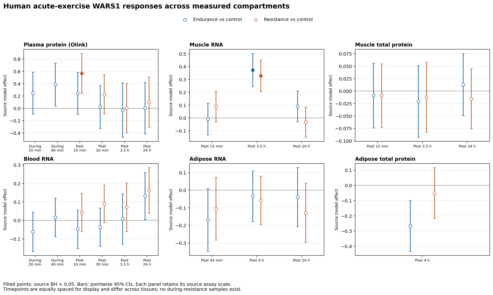
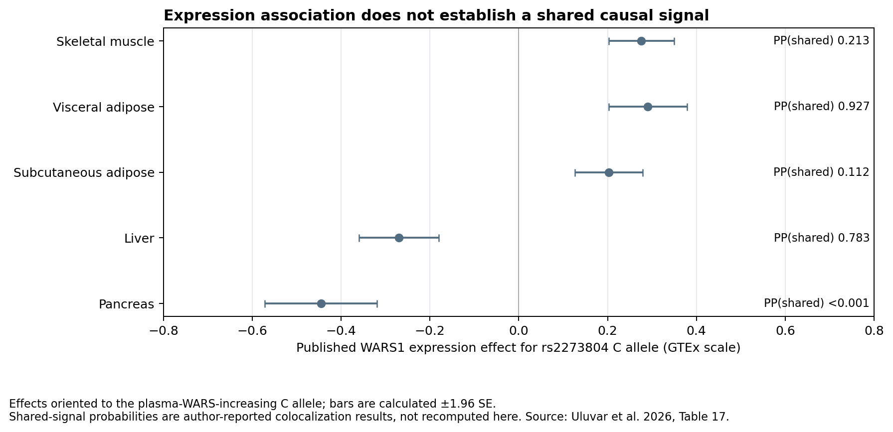

# WARS1: detailed follow-up in human MoTrPAC

26 September 2026. See the executed [WARS1 notebook](../../wars1_differential_analysis.ipynb), [all primary results](wars1_primary.csv), and [provenance](provenance.json).

**WARS1 deserves follow-up because the available human data show an early circulating-protein response and later muscle transcription, while external experiments and human genetics connect the gene with immune, vascular, and metabolic biology. The central unresolved question is which molecular form rises after exercise and whether it has extracellular activity.**

## What the available exercise data establish

We analyzed the pinned human c2.0 acute-exercise release, package 2.0.8, commit `535b4044e7417413de471104c619120337602b77`. MoTrPAC supplied raw p-values, effects, and confidence intervals. We did not fit a new participant-level model. Source BH was independently reproduced across 159 assay/comparison families covering 2,068,077 feature–contrast tests, including within-arm and baseline comparisons; maximum absolute discrepancy was 4.88 × 10⁻¹⁵. All 58 WARS1 rows shared with the earlier screen match. [Source package](https://github.com/MoTrPAC/MotrpacHumanPreSuspensionAnalysis/tree/535b4044e7417413de471104c619120337602b77).

There are **180 WARS1 source estimates and 52 primary exercise-versus-control estimates**, including two muscle phosphosites. Exactly **three primary estimates** pass original assay-wide BH < 0.05:

| Measurement | Comparison | Time | Effect, source `logFC` | Raw p | Source BH-adjusted p |
|---|---|---|---:|---:|---:|
| Plasma Olink protein | Resistance vs control | Post 10 min | +0.567 | 0.000734 | **0.0312** |
| Muscle RNA | Endurance vs control | Post 3.5 h | +0.374 | 3.04 × 10⁻⁸ | **1.48 × 10⁻⁶** |
| Muscle RNA | Resistance vs control | Post 3.5 h | +0.329 | 3.15 × 10⁻⁷ | **3.63 × 10⁻⁶** |

The primary effect is the difference in baseline-to-timepoint changes between exercise and resting control. Plasma's 95% pointwise CI is **0.242–0.892**. We retain source effect scales; these numbers are not absolute concentrations or asserted percentage increases. The plasma result survives the previous pooled correction across all 14,170 primary plasma tests (q **0.0408**), but that is a sensitivity analysis on the same data.

Additional details strengthen interpretation:

- **There is also a within-resistance increase:** at 10 minutes, RE minus its baseline is +0.371, q **0.00812**. Control minus its baseline is −0.196, q **0.751**. Their difference is +0.567. The primary result is therefore not solely attributable to a falling control estimate.
- **Resistance specificity is not established.** The direct EE-RE plasma comparison at 10 minutes has raw p **0.0442**, but BH-adjusted p **0.227**. No direct WARS1 comparison passes BH < 0.05. During-resistance samples are unavailable.
- **Muscle total protein does not significantly increase.** No primary BH hit occurs in muscle total protein, blood RNA, adipose RNA/protein, or the measured WARS1 phosphosites S4 and S353. Stable bulk abundance cannot exclude release of a small fraction or a particular form.
- **Baseline differences must not be mistaken for responses.** Adipose WARS1 protein has significant baseline group differences. Those rows share labels such as EE-CON but have `contrast_type=baseline`; they are explicitly excluded from exercise-response counts.
- **Timing does not establish muscle as the source.** The sampled muscle RNA increase follows the plasma signal by hours. Replenishment of a released pool is one hypothesis, not a demonstrated sequence.

The points above are model estimates, not individual participants. Filled points pass source BH; intervals are pointwise, not adjusted for multiple testing. The underlying study includes 175 people overall, with varying assay-specific sample availability.

## Why WARS1 biology is more complicated than a single circulating concentration

WARS1, also called WARS/WRS/IFI53 or TrpRS, is the cytoplasmic tryptophanyl-tRNA synthetase. It normally supports protein synthesis. Our plasma feature is **OID21084**, mapping to **P23381** and RNA feature **ENSG00000140105.18**. It is not mitochondrial WARS2. [UniProt](https://www.uniprot.org/uniprotkb/P23381/entry).

The same gene can produce proteins with distinct activities:

| Form or compartment | External evidence | Consequence for our hypothesis |
|---|---|---|
| Intracellular WARS1 | Enzyme involved in tRNA charging and a reported substrate-dependent insulin-receptor modification | Increased plasma signal cannot establish this intracellular mechanism |
| Extracellular WARS1 | Direct/vesicular release and innate immune signaling | A plausible exerkine route, requiring validation after exercise |
| Mini-WARS | Splice form with experimental effects on endothelial junctions and permeability | A potentially different vascular signal from full-length protein |
| T2-WARS | Cleavage product with anti-angiogenic activity | A rise in an unresolved assay signal has no single interpretable vascular direction |

Primary sources: [secretion](https://pubmed.ncbi.nlm.nih.gov/36640342/), [TLR/TREM-1 signaling](https://doi.org/10.3390/biom10091283), [mini-WARS and NRP1](https://doi.org/10.1038/s41467-022-31904-1), [T2-WARS and VE-cadherin](https://doi.org/10.1074/jbc.C400431200).

The public Olink description does not establish which forms its antibodies recognize in these samples. It also does not permit conversion of NPX to absolute plasma concentration. Gene-level RNA, bulk protein, and two phosphosites cannot resolve alternative splicing or cleavage. [Olink assay documentation](https://olink.com/assay/explore/neurology/tryptophan-trna-ligase-cytoplasmic).

## Disease relevance: useful evidence, with distinct interpretations

**Insulin signaling:** A 2024 study reported WARS-dependent insulin-receptor K1209 tryptophanylation under excess tryptophan, attenuating signaling; SIRT1 reversed the modification. This intracellular mechanism does not demonstrate an effect of circulating exercise-induced WARS1. [Sun et al., 2024](https://doi.org/10.1007/s00018-023-05082-2).

**Human genetics:** We extracted published WARS1 disease and tissue-QTL rows directly from supplementary tables. The reported shared-signal probabilities are 0.975 for coronary artery disease and 0.770 for HbA1c. Tissue colocalization is stronger for visceral adipose (0.927) than muscle (0.213), despite a strong muscle expression association. These are author-reported results, not newly fitted causal analyses. [Uluvar et al., 2026, tables 16–17](https://doi.org/10.1007/s00125-026-06800-8).

**Splicing and hypertension:** A separate study connects a WARS1 exon-10 splicing QTL, plasma protein, and hypertension through colocalization. That supports examining molecular forms rather than assuming gene-level abundance is the relevant causal exposure. [Tokolyi et al., 2025](https://doi.org/10.1038/s41588-025-02096-3).

A colocalization probability is support for a shared genetic association signal under a model; it is not the probability that WARS1 causes disease. A variant may act through specific tissues, splicing, or additional molecular consequences. Sustained genetically associated differences also cannot substitute for a brief exercise exposure. The disease table's outcome effects belong to different lead variants; we preserve those original coefficients rather than incorrectly treating them as harmonized effects of one SNP.

The separate glucose-challenge experiment is small and does not meet our 0.05 threshold for its WARS1 interaction. See the notebook's exact extracted result and threshold discussion. It supplies context rather than replication of an exercise mechanism.

## Does available tryptophan data support the insulin-resistance mechanism here?

We checked tryptophan and kynurenine in the existing human metabolite summaries as a separate, post hoc contextual analysis. At RE post 10 minutes, when plasma WARS1 peaks, circulating tryptophan has effect **−0.035**, raw p **0.240**, source q **0.360**. Muscle tryptophan has no source-q < 0.05 primary response. These observations do not demonstrate simultaneous substrate excess, though they cannot exclude local or unsampled changes.

Unlike the WARS1 protein/RNA corrections, the metabolite source q-values did **not** reproduce under either of the two attempted grouping rules. We preserve them as source-reported values, save the diagnostics, and do not treat this as an independently validated metabolite BH analysis. Its exact original testing universe/grouping remains unresolved. This limitation does not alter WARS1's primary results.

No substrate concentration, biochemical flux, kynurenine/tryptophan ratio, within-person correlation, or insulin-receptor modification can be inferred from these separate summary estimates.

## Best follow-up hypotheses

1. **A particular circulating WARS1 form carries an exercise-related signal.** First reproduce the Olink response with an independent protein assay and resolve full-length, spliced, cleaved, and vesicular species. If the signal fails orthogonal validation, the functional hypothesis weakens substantially.
2. **The extracellular signal affects endothelial or immune function.** Compare matched pre/post-exercise plasma, with WARS1 depletion and controlled form-specific add-back, using endothelial-barrier and innate-immune readouts. Include assay-specificity, cell-injury, plasma-volume, and endotoxin controls. A response unaffected by effective WARS1 depletion would weaken a WARS1-dependent mechanism.
3. **Later transcription replenishes a released pool.** This requires direct release measurements and cell/tissue attribution. Gene-level muscle induction alone cannot discriminate muscle-fiber release from vascular/immune cells or an unrelated parallel response.
4. **Intracellular metabolic context changes WARS1 function.** Test intracellular WARS manipulation under normal versus elevated tryptophan, measuring IR K1209 modification, insulin-stimulated signaling, and glucose uptake. Extracellular-protein addition is not an equivalent perturbation.

The strongest project framing is: **exercise engages a WARS1 response whose biological meaning may depend on molecular form, compartment, and duration; these need to be distinguished before assigning a diabetes or vascular effect.** The current evidence does not justify “WARS1 mediates exercise's antidiabetic benefit.”

## Novelty and outputs

**Updated 27 September 2026:** WARS1 is explicitly included in MoTrPAC's current Supplementary Table 7 and secretome Figure 7. Its absence from the older Table S8 checked in the preceding screen was version-specific. Earlier exercise evidence includes a 2015 transcript pilot, WARS enrichment in vesicles from electrically stimulated human muscle cells in 2023, and a 2025 human exercise conference abstract reporting a vesicular WARS1 decrease. Thus neither a first exercise association nor a new nomination beyond current MoTrPAC is supported. The vascular mechanism after exercise remains a question to test. See the [literature review, exact source links and version audit](novelty_review/REVIEW.md).

The executed notebook retains nonsignificant results and separate baseline/direct-mode comparisons. Reusable scripts are `analysis/extract_wars1.R`, `analysis/analyze_wars1.py`, and `analysis/build_wars1_notebook.py`. Cached original references, unmodified published workbook, extracted CSVs, source checksums, correction diagnostics, and PNG/SVG figures are in this results directory.
