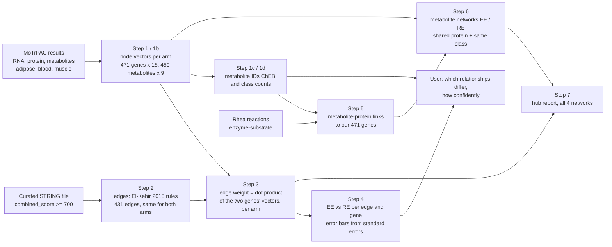

# Exercise network: endurance vs resistance

## 1. Project snapshot

**One line:** two molecular networks built from the MoTrPAC human acute-exercise results, one for
endurance and one for resistance exercise, over the same genes, so we can ask whether the two kinds of
exercise wire the body's molecular response more similarly or more differently.

This project helps **exercise biologists and hackathon collaborators** compare **endurance and
resistance exercise** using **MoTrPAC multi-omics results (RNA, protein, metabolites in adipose, blood
and muscle) and the STRING interaction database**, so they can **see which molecular relationships
differ between the two, and how confidently**.

| | |
|---|---|
| Hackathon | Stanford Multi-omics Hackathon 2026, Track 1 ("Exercise as Medicine") |
| Team | Vidal Arroyo (Stanford) — *TODO: add teammates and roles* |
| Intended users | Track 1 team and judges; exercise and network biologists who want a reusable, documented EE-vs-RE network |
| Status | Gene networks (steps 1–4) and metabolite networks (steps 5–6) built and validated; hub report (step 7) computed, no hubs removed yet; disease layer not started |

**Why it matters.** Endurance and resistance exercise are prescribed for different health outcomes,
yet most comparisons look at single molecules. A network view asks whether the *relationships* between
molecules change, which is closer to how exercise is thought to act on disease pathways.

## 2. Research question

- **Question:** across adipose, blood and muscle, and across RNA and protein, is the acute molecular
  response to endurance exercise wired more similarly or more differently from the response to
  resistance exercise, and which connections differ?
- **Approach:** an honest representation of both. Nothing is designed to make the two networks look
  alike: each arm's values come from its own comparison with the control group, both are measured in
  one shared unit, and every difference is compared against measurement noise.
- **Scope:** human pre-suspension (pre-COVID) adults, first acute bout, 0.5 / 4 / 24 h after exercise;
  genes measured as RNA and protein in all three tissues (471 genes); metabolites measured in all
  three tissues (450), connected through shared enzymes (Rhea).
- **Success means:** (a) every edge and gene difference between arms comes with an error bar and a
  multiple-testing-corrected p-value; (b) a reference tells us whether the overall similarity
  (r = 0.64) is higher or lower than measurement noise alone would give (*not yet computed*, see
  roadmap); (c) anyone can rerun the pipeline and get the numbers in section 7.

## 3. Workflow



1. **Nodes (step 1, genes; step 1b, metabolites).** Each gene gets two vectors, one per arm: how it
   changed after exercise (vs controls) in each tissue, layer and time. 18 numbers for genes (3 tissues
   × RNA/protein × 3 times), 9 for metabolites (3 tissues × 3 times).
2. **Edges (step 2).** STRING decides *whether* two genes are connected. This does not use the exercise
   data, so both arms have the same 431 edges.
3. **Weights (step 3).** The exercise data decides *how strong* each edge is in each arm: the dot
   product of the two genes' vectors.
4. **Comparison (step 4).** Per edge and per gene, is the endurance–resistance difference bigger than
   the measurement noise?
5. **Metabolite identifiers (steps 1c, 1d).** ChEBI and other database IDs and class counts.
6. **Metabolite networks (steps 5, 6).** Rhea links each metabolite to the proteins (among our 471
   genes) that use it as an enzyme substrate or product. Two metabolites are connected if they share
   such a protein AND the same RefMet super class; edge weights are dot products of their 9-number
   vectors, per arm. Same edges in both arms, as for genes.
7. **Hub report (step 7).** How many hubs each of the four networks has, and what hangs on them.
   Nothing is removed.

## 4. Setup

**Prerequisites**

| Component | Version used | Used for |
|---|---|---|
| R | 4.4.3 (≥ 4.4 required by the MoTrPAC package) | steps 1, 1b, 2, 3, 4, validation |
| Bioconductor | 3.20 (for R 4.4) | dependencies of the MoTrPAC package |
| `MotrpacHumanPreSuspensionAnalysis` | 0.2.4 | the data: differential-analysis results and feature-to-gene map |
| `data.table` | 1.18 | tables |
| `igraph` | 2.2 | network components |
| `nanoparquet` | 0.4 | reading the STRING `.parquet` file |
| `Matrix` | 1.7 | sparse gene × edge matrix (step 4) |
| Python | 3.9+ (3.12.4 used), standard library only | steps 1c (web lookups) and 1d |
| Internet | — | step 1c only |

**Install**

```r
if (!require("BiocManager", quietly = TRUE)) install.packages("BiocManager")
BiocManager::install(version = "3.20")                      # R 4.4; see the MoTrPAC package README for R 4.5/4.6
if (!require("pak", quietly = TRUE)) install.packages("pak")
pak::pak("MoTrPAC/MotrpacHumanPreSuspensionAnalysis")       # github.com/MoTrPAC/MotrpacHumanPreSuspensionAnalysis
install.packages(c("data.table", "igraph", "nanoparquet", "Matrix"))
```

**Data**

| Input | Where it comes from | Setting |
|---|---|---|
| MoTrPAC results | inside the R package above (no download) | — |
| STRING network | curated file supplied by the team: `Metabolomics_database_watershed_template_data_p_value_string_network_ge700.parquet` (received 2026-09-26; STRING release not recorded in the file) | `STRING_PARQUET` (default `~/Downloads/<that file>`) |
| Rhea (step 5) | downloaded automatically from ftp.expasy.org/databases/rhea/ on first run (release 142) | `HACK_EXT` (default `~/Desktop/output/hackathon-2026-track1/external/rhea`) |
| Results folder | created by step 1 | `HACK_OUT` (default `~/Desktop/output/hackathon-2026-track1/network`) |

Code and results are kept in separate trees: nothing is written inside the repo. That includes the
shareable feature lists (step 9, written to `$HACK_RES`) and the figures (step 10, written to `$HACK_FIG`,
default `~/Desktop/output/hackathon`).

## 5. Inputs, outputs and quick start

**Quick start** (from the repo root; about 3 minutes: step 1c ~2.5 min of web lookups, everything else ~30 s)

```bash
Rscript network/01_node_embeddings.R          # gene nodes
Rscript network/01b_metabolite_embeddings.R   # metabolite nodes
python3 network/01c_metabolite_ids.py         # metabolite IDs (web); EXPORT_COPY=path writes a 2nd copy
python3 network/01d_metabolite_classes.py     # metabolite class counts (offline)
Rscript network/02_string_edges.R             # STRING edges
Rscript network/03_edge_weights.R             # per-arm edge weights
Rscript network/04_compare_arms.R             # EE vs RE comparison (~10 s; N_BOOT sets the draws)
Rscript network/05_rhea_metabolite_protein.R  # metabolite-protein links (downloads Rhea once to $HACK_EXT)
Rscript network/06_metabolite_network.R       # metabolite networks, EE and RE
Rscript network/07_hub_report.R               # hubs in all four networks (nothing removed)
Rscript network/08_metabolite_rule_experiments.R  # how the metabolite edge rule affects coverage (report only)
Rscript network/resource/export_feature_lists.R  # shareable feature lists -> $HACK_RES (not committed)
Rscript network/10_plot_arm_networks.R        # figures: EE vs RE networks, genes and metabolites -> $HACK_FIG
Rscript network/99_validate_outputs.R         # checks everything; see section 7
```

**Output files** (all in `$HACK_OUT`)

| Step | File | Contents |
|---|---|---|
| 1 | `01_nodes_EE.csv`, `01_nodes_RE.csv` | **Gene node tables.** 471 rows: `entrez_gene`, `gene_symbol`, 18 scaled dimensions (layout below) |
| 1 | `01_nodes_{EE,RE}_raw_logFC.csv` | same, before scaling |
| 1 | `01_nodes_{EE,RE}_se.csv` | standard error of every value, same scale |
| 1 | `01_nodes_arm_corr.csv` | correlation between the *errors* of each gene's EE and RE estimates (shared control group; not a similarity of responses) |
| 1 | `01_scale_factors.csv` | the divisor for each tissue × layer |
| 1 | `01_nodes_feature_provenance.csv` | which transcript/protein was used for each gene, and how many candidates it was chosen from |
| 1b | `01b_metab_nodes_EE.csv`, `01b_metab_nodes_RE.csv` | **Metabolite node tables.** 450 rows: `metabolite`, 9 scaled dimensions |
| 1b | `01b_metab_nodes_{EE,RE}_raw_logFC.csv`, `..._se.csv`, `01b_metab_nodes_arm_corr.csv`, `01b_metab_scale_factors.csv` | as for genes |
| 1b | `01b_metab_nodes_provenance.csv` | the platform that measured each metabolite in each tissue |
| 1c | `01c_metabolite_ids.csv` | per metabolite: `refmet_name`, `name_match`, `refmet_id`, `super_class`, `main_class`, `pubchem_cid`, `inchi_key`, `chebi_id`, `chebi_all`, `chebi_method`, `lookup_status` |
| 1d | `01d_metabolite_class_counts.csv` | per super class and main class: `level`, `is_lipid`, `n_metabolites`, `pct_of_450`, `n_with_chebi`, `examples` |
| 2 | `02_edges.csv` | per edge: Entrez, symbol and UniProt of both genes, `combined_score`, `cos_EE`, `cos_RE` (cosine similarity of the two vectors, descriptive) |
| 2 | `02_nodes_string.csv` | per gene: UniProt, in STRING or not, degree, component |
| 2 | `02_network_summary.csv` | headline counts |
| 3 | `03_weighted_edges.csv` | per edge: `w_EE`, `w_RE`, `w_diff`, `sig_EE`, `sig_RE` |
| 4 | `04_edge_diff.csv` | per edge: weights, `w_diff` with 95% interval, `p_boot`, `fdr`, `higher_in` (arm with the higher signed weight), `larger_abs_in` (arm with the larger weight ignoring sign), `sign_change` |
| 4 | `04_node_diff.csv` | per gene with ≥ 1 edge: degree, strength per arm (signed and 0–1), difference with interval, p, FDR |
| 4 | `04_diff_subnetworks.csv` | connected groups of differing edges (FDR < 0.1: none; exploratory tier at p < 0.05) |
| 4 | `04_summary.csv` | headline numbers |
| 5 | `05_metabolite_protein_links.csv` | per metabolite–gene link: classes, UniProt, `n_reactions`, `example_reactions` (Rhea IDs), `matched_via` (as-is or pH 7.3 form) |
| 5 | `05_rhea_summary.csv` | Rhea release and coverage counts |
| 6 | `06_metabolite_edges.csv` | per metabolite edge: `main_class`, `n_shared_proteins`, `shared_proteins`, `w_EE`, `w_RE`, `w_diff`, `sig_EE`, `sig_RE` |
| 6 | `06_metabolite_nodes.csv`, `06_metabolite_summary.csv` | per metabolite: class, proteins, degree, component; headline counts |
| 7 | `07_hub_summary.csv` | per network × hub type: degree distribution, El-Kebir and Tukey cutoffs, number of hubs, top hub, top strength per arm |
| 7 | `07_hub_list.csv` | every node above the Tukey fence, with its attached analytes and per-arm strength |
| 9 | `$HACK_RES/proteins_471.csv`, `metabolites_450.csv` (not committed) | feature lists with identifiers for searching other datasets; columns in `network/resource/README.md` |
| 10 | `$HACK_FIG/10a_gene_networks_EE_vs_RE.png`, `10b_metabolite_networks_EE_vs_RE.png` (not committed) | the EE (top) and RE (bottom) networks in one identical layout |
| 8 | `08_metabolite_rule_experiments.csv` | per rule variant: proteins allowed, metabolites with a protein, pairs sharing a protein, edges, metabolites in the network, change vs baseline |

**Gene vector layout (18 dimensions, per arm)**

```
adipose_rna_0.5h  adipose_rna_4h  adipose_rna_24h  adipose_prot_0.5h  adipose_prot_4h  adipose_prot_24h
blood_rna_0.5h    blood_rna_4h    blood_rna_24h    blood_prot_0.5h    blood_prot_4h    blood_prot_24h
muscle_rna_0.5h   muscle_rna_4h   muscle_rna_24h   muscle_prot_0.5h   muscle_prot_4h   muscle_prot_24h
```

`adipose_prot_0.5h` and `adipose_prot_24h` are empty for every gene (adipose proteomics was only
profiled at 4 h). **Metabolite layout (9 per arm):** `adipose_metab_0.5h … muscle_metab_24h`, nothing
missing.

## 6. Methods and provenance

### Data and upstream QC (done by the MoTrPAC consortium; we read published results)

- **Source:** `MotrpacHumanPreSuspensionAnalysis` v0.2.4 (MoTrPAC human pre-suspension study).
  Differential-analysis tables `*_TRNSCRPT_DA`, `*_PROT_PR_DA`, `BLOOD_PROT_OL_DA`, `*_METAB_DA`;
  gene map `HUMAN_FEATURE_TO_GENE`. No statistics are re-run on raw data.
- **Samples:** first supervised bout only (visit `ADU_BAS`); samples in the consortium's outlier list
  (`OUTLIERS`: mostly RIN < 5, principal-component outliers and blood contamination, a few
  genotype/sex-check failures) removed before normalisation, for every assay.
- **RNA-seq (3 tissues):** genes kept if > 0.5 counts per million in ≥ 10% of samples; TMM
  normalisation; voom weights; dream linear mixed model
  `~ 0 + group_timepoint + Batch + BMI + calculatedAge + codedsiteid + pct_umi_dup + RIN + Sex + (1 | pid)`.
- **MS proteomics (adipose, muscle; TMT):** log2 ratios to a pooled reference, median-normalised,
  batch effects removed, missingness-filtered; kept only if every group × timepoint with paired data
  has ≥ 3 participants measured before and after (`filter_paired_n`); model
  `~ 0 + group_timepoint + BMI + calculatedAge + Sex + (1 | pid)`.
- **OLINK (blood):** targeted ~1,400-protein panel; same model as MS.
- **Metabolomics (10–12 platforms per tissue):** zero/negative values set missing; features missing in
  > 20% of samples removed; min-value/KNN hybrid imputation (half-minimum for small targeted panels);
  log2; median/MAD normalisation for untargeted platforms where sample intensity is not associated with
  sex or group; names standardised to RefMet; one platform per metabolite per tissue, the lowest-CV
  one. Models as above plus `codedsiteid`; untargeted adds `raw_intensity_post`.

### Our choices

| Step | Choice | Why |
|---|---|---|
| 1 | Delta-delta contrasts EE-CON and RE-CON at 0.5 / 4 / 24 h | removes changes that happen to controls too |
| 1 | Genes measured in all six tissue × layer combinations, matched by Entrez ID (471) | every node has a complete vector; blood OLINK is the limit (without it: 4,878) |
| 1 | One feature per gene: highest `AveExpr` | never looks at the exercise response (for MS proteins AveExpr is a log-ratio, so this is a fixed tie-break; 20 genes affected) |
| 1 | Divide each tissue × layer by its root-mean-square logFC, one divisor shared by both arms | common unit that keeps real arm and time differences; mostly equalises noise, so scaled values are not cross-block effect sizes |
| 1 | Standard error = logFC / t | exact; the stored degrees of freedom are not the ones the confidence interval used |
| 1b | Metabolites in all three tissues, exact RefMet names (450) | lipid punctuation is meaningful (`PC 16:0/20:4` ≠ `PC 16:0_20:4`) |
| 2 | El-Kebir et al. 2015 §3.3 network rules on the curated STRING file | published construction; note the background network differs from theirs (below) |
| 3 | Edge weight = dot product of the whole 16-dimension vectors, per arm | encoder–decoder node-similarity framework (Hamilton, Ying & Leskovec 2017) |
| 3 | 0–1 weights σ(w / s), s = median \|w\| over both arms (2.667) | temperature scaling; s set by analogy with the median heuristic |
| 4 | Monte Carlo error propagation from standard errors, with the EE/RE error correlation | error bars for every difference; ignoring the correlation would hide real differences |
| 5 | Metabolite–protein = Rhea enzyme–substrate, human proteins among our 471 genes; our ChEBI IDs also matched in their pH 7.3 form | curated, keyed by ChEBI and UniProt; Rhea writes molecules as they exist at physiological pH |
| 6 | Metabolite edge = shares ≥ 1 of our 471 genes' proteins AND same RefMet super class (14; team rule, chosen after step 8); weight = dot product of 9-number vectors | exercise-independent gate, as for genes; restricting to our measured genes is the more rigorous choice; inferred functional links, not physical |
| 7 | Hubs reported with the El-Kebir cutoff (Q75 + 40 × IQR) and the Tukey fence (Q75 + 1.5 × IQR); none removed | team decision: inspect before removing |

### Step details

**Step 1 — gene nodes.** Values are the delta-delta logFC (exercise arm's change from pre-exercise
minus the control group's change). Scale divisors (RMS logFC): adipose RNA 0.112, blood RNA 0.206,
muscle RNA 0.216, adipose protein 0.178 (4 h only), blood OLINK 0.378, muscle protein 0.100. The error
correlation between arms has median 0.63 (per-dimension medians 0.49–0.67). Several features for one
gene: 12 genes in muscle protein, 9 in adipose protein, 2 per tissue in RNA.

**Step 1b — metabolite nodes.** 450 metabolites (428 on untargeted platforms in all three tissues; 22
use a targeted panel in at least one). Divisors: adipose 0.249, blood 0.231, muscle 0.307. Error
correlation median 0.65. Note: "EPA" and "Eicosapentaenoic acid" are both nodes: RefMet keeps two
records (the specific all-cis structure, measured on a reversed-phase platform, and an unspecified
isomer, measured on the lipid platform), and they are not merged.

**Step 1c — metabolite IDs.** RefMet record → InChIKey (structure fingerprint) → ChEBI via UniChem
(structure match; PubChem synonyms as fallback). Names containing "/" (chain positions known) go
through RefMet's name matcher and details are fetched by RefMet ID, because RefMet's server refuses an
encoded "/"; every row records whether RefMet's name equals ours (`name_match`). Metabolites with no
single structure get a ChEBI ID only if a ChEBI entry has exactly the reformatted name
(`PC 16:0_18:1` → `PC(16:0_18:1)`); no fuzzy matching. **Result: 213 of 450** (204 by structure via
UniChem, 2 via PubChem, 7 by exact name). `name_match`: 440 exact, 7 synonyms (e.g. Edetic acid →
EDTA, NAD+ → NAD), 3 with no RefMet record (`Leucine/Isoleucine`, `Citric acid/Isocitric acid`,
`C1-DeoxyCer 18:0;O/24:1`). The 237 blanks are mostly lipid species defined without chain positions
(101 glycerophospholipids, 69 glycerolipids, 32 fatty acyls, 28 sphingolipids), plus those 3 and
Hydroxyproline, Phosphoglyceric acid (no structure in RefMet), Tridecylamine and alpha-Tocoquinone
(structure but no ChEBI entry). 33 metabolites have more than one ChEBI ID (usually neutral and
charged forms). RefMet assigns stereoisomers where it can (lactic acid → L-lactic acid, CHEBI:422)
even when the assay does not separate them.

**Step 1d — metabolite classes (RefMet).** 320 of 450 are in lipid super classes (LIPID MAPS
categories). RefMet's taxonomy files some small water-soluble acids (hydroxybutyric acids, GABA,
glutaric, azelaic, sebacic acid) under Fatty Acyls, so this slightly overstates true lipids.

| Super class | n | % | Largest main classes |
|---|---|---|---|
| Glycerophospholipids | 109 | 24.2 | PC 71, PE 38 |
| Fatty Acyls | 83 | 18.4 | fatty acids 55, fatty esters 19 (all 19 acylcarnitines) |
| Glycerolipids | 70 | 15.6 | triglycerides 59, diglycerides 8 |
| Organic acids | 66 | 14.7 | amino acids and peptides 46, TCA acids 6 |
| Sphingolipids | 49 | 10.9 | sphingomyelins 31, ceramides 13 |
| Nucleic acids | 28 | 6.2 | purines 17, pyrimidines 9 |
| Alkaloids | 14 | 3.1 | |
| Benzenoids | 7 | 1.6 | |
| Sterol Lipids | 7 | 1.6 | bile acids 3 |
| Organic nitrogen compounds | 6 | 1.3 | |
| Carbohydrates | 3 | 0.7 | |
| Organoheterocyclic compounds | 3 | 0.7 | |
| Prenol Lipids | 2 | 0.4 | |
| Unclassified | 3 | 0.7 | the 3 without a RefMet record (kept, not assigned by hand) |

**Step 2 — edges.** El-Kebir et al. 2015 §3.3: undirected STRING network; remove outlier hubs (degree >
75th percentile + 40 × IQR on the full network: cutoff 741, highest degree 407, **none removed**);
keep edges between our genes. The file: 124,099 pairs, 13,855 proteins (13,846 UniProt IDs; 9 other
IDs that never match), all combined_score ≥ 700. **Difference from the paper:** they used STRING v9.1
`protein.actions` (experimental direct interactions plus orthology-predicted ones); our file is an
all-evidence combined_score ≥ 700 network that also counts co-expression and text mining.
Result: 444 of 471 genes in STRING; **431 edges**; 185 isolated genes; largest component 230; median
degree 1 (top: ITGB1 21, CD34 16, NT5E 16, ITGAM 14). The node set is dominated by secreted and
cell-surface proteins because blood protein is the OLINK panel.

**Step 3 — weights.** w = dot product of the two genes' 16 observed dimensions, per arm. Large positive
= on balance the same direction, strongly; large negative = on balance opposite; near zero = weak
responses *or* dimensions that cancel. Medians 1.24 (EE) / 1.89 (RE); ranges −14.8 to 66.2 / −54.0
to 66.8; 145 / 137 negative. The 0–1 version σ(w / s): the sigmoid of a dot product is the edge
decoder of LINE (Tang et al. 2015) and graph autoencoders (Kipf & Welling 2016). Dividing by s is
temperature scaling (Hinton, Vinyals & Dean 2015; Guo et al. 2017); without it about 30% of weights
sit above 0.99 or below 0.01, with it about 6%. s is set by analogy with the median heuristic for
kernel widths (Gretton et al. 2012), and it is one constant for both arms: a unit of measurement, so a
real arm difference passes through unchanged, whereas a separate s per arm could hide one. Because the
sigmoid is curved, similarity-vs-difference conclusions use raw w.

**Step 4 — EE vs RE.** In each of 10,000 rounds every value is redrawn from its standard error, the
EE and RE values of a gene jointly with their error correlation, and all weights recomputed. Two-sided
p = 2 × min(share ≤ 0, share ≥ 0); Benjamini–Hochberg FDR within edges and within genes (Efron &
Tibshirani 1993 for the bootstrap). An arm-label swap permutation was tried and rejected: with two
genes per edge, half of all swaps reproduce the observed |w_diff|, so no edge can reach p < ~0.5.

**Step 5 — metabolite–protein links (Rhea).** Rhea release 142 (2026-09-02), downloaded 2026-09-26
(files cached in `$HACK_EXT`). A metabolite is linked to one of our genes if it is a participant in a
Rhea reaction that the gene's reviewed (Swiss-Prot) protein catalyses. Our ChEBI IDs are matched as-is
and in their pH 7.3 form (Rhea's mapping), so L-lactic acid finds L-lactate. Rhea's generic lipid
entries are not expanded to our species. **Result:** 175 of our 213 ChEBI-identified metabolites occur in
Rhea; **60 metabolites link to 80 of our 471 genes (186 links)**. Coverage is limited because the gene
set (bounded by the blood OLINK panel) has few metabolic enzymes, and most lipid species have no ChEBI ID.

**Step 6 — metabolite networks.** Rule: a shared protein among our 471 genes AND the same RefMet
**super class** (14 families; chosen by the team after step 8; `METAB_CLASS_LEVEL=main_class` switches
back to the 50 main classes). 161 metabolite pairs share a protein; **122 also share a super class and
become edges**, among **44 metabolites** in 5 components (largest 15): nucleic acids 54 edges, fatty
acyls 35, organic acids 23, sphingolipids 10. Same edges in both arms; weights per arm (sigmoid scale
s = 1.82). The two arms' metabolite edge weights correlate at r = 0.15 and 41 of 122 edges change sign
(no noise reference yet; the step 4 comparison has not been run on metabolites). The edge table keeps
both metabolites' main classes (`main_class_a`, `main_class_b`) so cross-main-class edges are visible.

**Step 7 — hubs (nothing removed).**

| Network (EE and RE share edges) | Hub type | Connected nodes | El-Kebir hubs | Tukey hubs (cutoff) | Top hub (what hangs on it) |
|---|---|---|---|---|---|
| Gene networks | gene | 286 | 0 | 13 (degree > 8.5) | ITGB1: 21 genes (integrins, CD34, ICAM1, PECAM1, …) |
| Metabolite networks | metabolite | 44 | 0 | 0 (degree > 14.4) | AMP: 13 nucleic acids |
| Metabolite networks | mediating protein | 80 | 0 | 3 (> 6 metabolites) | NT5E: 9 nucleotides/nucleosides, supports 36 of the 122 edges |

The other flagged mediating proteins are MGLL (8 fatty acids, supports 28 edges) and SLC27A4 (7: fatty
acids, ATP, AMP; 11 edges). With the super class, purines and pyrimidines share a class, so NT5E links
all nine of its nucleotides to each other (36 edges, up from 16 under the main class). The largest
shared-protein support is ATP–ADP (20 shared kinases and other ATP-using enzymes), the classic
"currency metabolite" effect. Hub *strength* differs by arm: e.g. CD34 (gene) 121.7 in EE vs 43.8 in
RE; NT5E (protein) 103.6 vs 328.4.

**Step 8 — metabolite rule experiments (report only; steps 5–6 outputs unchanged).** One change at a
time from the original main-class rule (shared protein only, no hub removal). The team then adopted
experiment 2 as the step 6 rule, keeping our 471 genes as the more rigorous protein set:

| Rule | Proteins allowed | Metabolites with a protein | Edges | Metabolites in network | Change |
|---|---|---|---|---|---|
| Baseline: our 471 genes, main class (50) | 472 | 60 | 78 | 39 | — |
| Exp 1: all human reviewed Rhea enzymes, main class | 4,140 | 155 | 555 | **126** | **+87** |
| **Exp 2: our 471 genes, super class (14) — adopted** | 472 | 60 | 122 | **44** | **+5** |
| Side line: Rhea enzymes from any organism, main class | 236,245 | 171 | 618 | 138 | +99 |

"Human reviewed" = UniProtKB/Swiss-Prot, organism 9606 (20,431 accessions, downloaded 2026-09-26).
Coverage is limited by which proteins may link metabolites, not by the class rule: the class level
only regroups the same 60 protein-linked metabolites.

**Step 10 — figures.** Layered like week 5's figure 3.1 (El-Kebir et al. 2015, Figure 4): endurance
network on top, resistance below. Both layers use ONE identical layout (fixed seed), and there are no
lines joining the layers: figure 3.1 needs them because human and rat networks contain different genes,
whereas our two networks contain exactly the same nodes and edges by construction, so the lines would
carry no information. With identical positions, the differences between arms are read from the
encodings. Node colour = mean scaled
response across the node's dimensions (violet down, orange up, limits ±2); node size = strength in that
arm; edge width = |w|, solid = positive, dashed = negative. Genes: triangle = strength differs between
arms at uncorrected p < 0.05 (step 4; hypothesis-level). Metabolites: shape = RefMet super class. Only
connected nodes are drawn (286 genes, 44 metabolites). Titles are descriptive only.

### External code, AI use, citations, licence

- **External code:** none copied; the method follows the papers cited here.
- **AI use:** the scripts and this README were written with Anthropic's Claude (Claude Code) working
  under Vidal Arroyo's direction; analysis choices were made by the team. The code was reviewed by
  three independent AI review passes against the package source and by independent recomputation of
  every output, and it is checked by `99_validate_outputs.R`.
- **Web services queried on 2026-09-26 (step 1c):** RefMet REST API (Metabolomics Workbench), UniChem
  (EMBL-EBI), PubChem PUG-REST (NCBI), Ontology Lookup Service (EMBL-EBI). Only metabolite names and
  structure keys were sent. Rhea files (release 142) downloaded from ftp.expasy.org on 2026-09-26;
  human Swiss-Prot accession list from the UniProt REST API on 2026-09-26 (step 8).
- **Data terms:** MoTrPAC data are subject to the consortium's data-use terms (motrpac-data.org);
  STRING, ChEBI and Rhea data are CC BY 4.0; see the Metabolomics Workbench, UniChem and PubChem sites for
  their terms.
- **References:** El-Kebir M et al. (2015) xHeinz, *Bioinformatics* 31:3147–3155 · Hamilton WL, Ying R,
  Leskovec J (2017) Representation learning on graphs, *IEEE Data Eng. Bull.* · Tang J et al. (2015)
  LINE, *WWW* · Kipf TN, Welling M (2016) Variational graph auto-encoders, arXiv:1611.07308 · Hinton G,
  Vinyals O, Dean J (2015) Distilling the knowledge in a neural network, arXiv:1503.02531 · Guo C et al.
  (2017) On calibration of modern neural networks, *ICML* · Gretton A et al. (2012) A kernel two-sample
  test, *JMLR* 13:723–773 · Efron B, Tibshirani RJ (1993) *An Introduction to the Bootstrap* ·
  Szklarczyk D et al. STRING database, *Nucleic Acids Res.* · Fahy E, Subramaniam S (2020) RefMet,
  *Nat. Methods* 17:1173 · Bansal P et al. (2022) Rhea, the reaction knowledgebase in 2022,
  *Nucleic Acids Res.* 50:D693 · Tukey JW (1977) *Exploratory Data Analysis*.
- **Licence:** MIT (repository `LICENSE`, © 2026 Stanford Bioinformatics Center).

## 7. Validation

Run `Rscript network/99_validate_outputs.R` after the pipeline. It runs **29 hard checks** (table
sizes; no unexpected missing values; no self-linked or duplicated edges; every weight equals the dot
product of the node vectors; sigmoid correct; p-values and FDR valid; strengths equal summed weights;
class counts add up to 450; metabolite edges obey the class and shared-protein rules) and compares the headline numbers below, printing "same" or "CHANGED".

| Result | Expected (2026-09-26) |
|---|---|
| Genes / metabolites | 471 / 450 |
| Metabolites with ChEBI | 213 |
| Metabolites in lipid super classes | 320 |
| Edges / isolated genes / largest component / hubs removed | 431 / 185 / 230 / 0 |
| Sigmoid scale s | 2.667 |
| cor(w_EE, w_RE) / edges changing sign | 0.64 / 130 |
| Edges at FDR < 0.1 / nominal p < 0.05 (chance: ~22) | 0 / 12 |
| Genes at FDR < 0.1 | 1 (HSPB1) |
| Metabolites / genes linked through Rhea | 60 / 80 |
| Metabolite edges / metabolites in the network (super class) | 122 / 44 |
| Gene hubs (Tukey) / hubs by the El-Kebir rule in any network | 13 / 0 |

**Result, stated carefully.** The two arms' edge weights correlate at r = 0.64. Re-drawing the
measurement noise pulls that correlation down (median 0.53, middle 95% 0.34–0.69); this spread is *not*
a confidence interval for the true correlation. Whether 0.64 means "similar" or "different" needs the
noise-only reference (roadmap). No edge difference survives FDR < 0.1. Twelve edges pass an uncorrected
p < 0.05, **fewer than the ~22 expected by chance** among 431, so they are hypotheses only: HSPA1A–HSPB1,
HSPB1–BAG3, CD55–CD59, LPL–SORT1, ITGAV–ITGB1, ITGAV–MFGE8, PODXL–EZR and STIP1–CCT5 higher in RE;
HSPA1A–DNAJB1, SLC16A1–BSG, CEBPB–FOXO1 and SCLY–TXNRD1 higher in EE. One gene passes FDR < 0.1,
HSPB1 (FDR 0.057, higher in RE), largely through its single edge to HSPA1A, and not on the 0–1 weights.
Many of the 130 sign changes are near-zero weights flipping within noise. Most responses are small
relative to their error (median |value| / SE = 0.83 for genes, 0.80 for metabolites, both arms), so the
tests have little power: **"not significant" is not evidence that the arms are the same.**

**Known failure modes and limits**

- Step 1c depends on live web services; failed requests are marked `lookup_status = error` (none on
  2026-09-26) and a rerun can differ slightly as databases change.
- Errors are treated as independent between genes and between the dimensions of one gene; real
  correlations there could make p-values somewhat too small.
- "0.5h" and "4h" are the package's collection windows, not exact minutes, and differ slightly by tissue.
- Adipose protein exists at 4 h only, and its scale divisor uses 4 h only.
- The universe is limited to 471 genes by the OLINK panel, biasing the network to secreted and
  surface proteins.
- A new STRING file changes steps 2–4; the validator will flag the changed numbers.

## 8. Reuse

**Repository layout**

```
README.md                  challenge description (organisers)
LICENSE                    MIT
network/
  README.md                this document
  01_node_embeddings.R     step 1   gene nodes
  01b_metabolite_embeddings.R  step 1b  metabolite nodes
  01c_metabolite_ids.py    step 1c  metabolite IDs (ChEBI etc.)
  01d_metabolite_classes.py    step 1d  metabolite class counts
  02_string_edges.R        step 2   STRING edges
  03_edge_weights.R        step 3   per-arm edge weights
  04_compare_arms.R        step 4   EE vs RE comparison
  05_rhea_metabolite_protein.R  step 5  metabolite-protein links (Rhea)
  06_metabolite_network.R  step 6   metabolite networks
  07_hub_report.R          step 7   hub report (all four networks)
  08_metabolite_rule_experiments.R  step 8  metabolite edge-rule experiments
  10_plot_arm_networks.R   step 10  figures of the EE vs RE networks (written outside the repo)
  resource/
    README.md              how to regenerate the feature lists, and their columns
    export_feature_lists.R step 9   writes proteins_471.csv and metabolites_450.csv to $HACK_RES (not committed)
  99_validate_outputs.R    checks
```

Every script is commented line by line in plain language, with a header covering what it does, the
upstream QC, our filtering, methods, references and tools. Outputs are written outside the repo.

**Citation:** Arroyo V et al. (2026) *Exercise network: endurance vs resistance*, Stanford Multi-omics
Hackathon 2026 Track 1, github.com/Stanford-Bioinformatics-Center/multiomics-hackathon-2026-track-1.
Please also cite MoTrPAC, STRING and the methods above.

**Roadmap / next steps**

1. Rerun steps 2–4 on the second curated STRING file when it arrives.
2. Compute the noise-only reference for r (arms identical except for noise) and the unrelated-arms
   floor, to answer similar-vs-different.
3. Consider weighting each dimension by its precision (value / SE) to gain power.
4. Decide on hub removal (step 7 report); run the step 4 comparison on the metabolite networks;
   consider expanding Rhea's generic lipid entries to cover lipid species.
5. Add the disease layer: the Track 1 brief asks each team to pick a single disease; this network work
   is disease-agnostic so far.

**Contributors and roles:** Vidal Arroyo — analysis design, direction, review. *TODO: add teammates.*

**Honest roadblocks:** low statistical power (responses near their noise level); the OLINK panel limits
the gene set; the curated STRING file's release and processing are undocumented; the similar-vs-different
verdict still needs its reference distribution.
