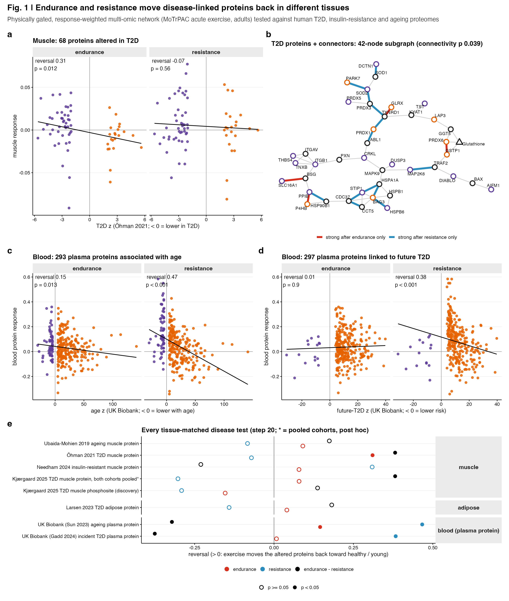
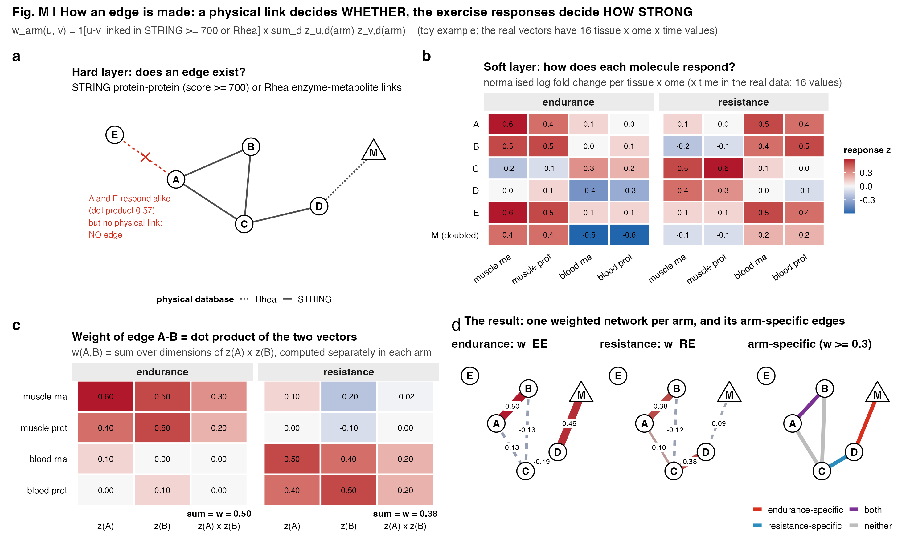
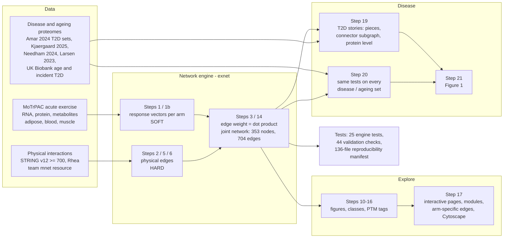

# Exercise network: endurance vs resistance, in the context of disease

> **Team 2-PAC · Stanford Multi-omics Hackathon 2026 · Track 1 "Exercise as Medicine"**
> **Headline:** endurance and resistance exercise move disease-linked proteins back toward healthy **in different
> tissues** — endurance in **muscle** (T2D proteome), resistance in **blood** (the plasma proteins of ageing and of
> future T2D, UK Biobank) — read off one physically gated, exercise-weighted multi-omic network.



## 1. Project snapshot

**One line:** a molecular network of 471 genes/proteins and 450 metabolites built from the MoTrPAC human
acute-exercise results, where **physical interaction databases decide whether two molecules are connected** and
**the exercise responses decide how strongly**, separately for endurance and resistance exercise — then tested
against published human disease and ageing proteomes.

This project helps **exercise and network biologists** compare **endurance and resistance exercise in the context
of disease** using **MoTrPAC multi-omics results (RNA, protein, metabolites; adipose, blood, muscle), STRING / Rhea
physical interactions and seven published disease / ageing proteomes**, so they can **see which disease-linked
molecules and relationships each kind of exercise moves, in which tissue, and how confidently**.

| | |
|---|---|
| Hackathon | Stanford Multi-omics Hackathon 2026, Track 1 ("Exercise as Medicine"; the brief asks each team to pick one disease: ours is type 2 diabetes, T2D) |
| Team | Team 2-PAC — see *Contributors and roles* (section 8) |
| Intended users | judges and Track 1 teams; exercise, diabetes and network biologists who want a reusable, documented, fully reproducible endurance-vs-resistance network |
| Status | **complete and reproducible**: one command (`bash network/run_all.sh`, ~10 min) rebuilds every table, figure and interactive page, runs 44 validation checks + 25 engine tests, and confirms all 136 outputs are byte-identical to the reference run |

**Why it matters.** Endurance and resistance exercise are prescribed for different health outcomes, yet most
comparisons look at one molecule at a time. A network asks whether the *relationships* between molecules change,
and the disease tests ask whether each kind of exercise pushes the molecules a disease disturbs back toward normal.

## 2. Research question

- **Question:** do endurance and resistance exercise differ in how they move the molecules and molecular
  relationships that are disturbed in type 2 diabetes (and in ageing, its main risk factor)? In which tissue?
- **Hypothesis:** the two arms act on different parts of the network, so their "disease-reversing" effects should
  differ by tissue and by disease signature.
- **Scope:** MoTrPAC human pre-suspension adults, first acute bout, 0.5 / 4 / 24 h; 471 genes measured as RNA and
  protein in adipose, blood and muscle, and 450 metabolites. Disease data only from tissues we measure (muscle,
  adipose, blood/plasma): T2D (Amar et al. 2024 sets; Kjærgaard 2025; Needham 2024; Larsen 2023; UK Biobank incident
  T2D) and ageing (Ubaida-Mohien 2019 muscle; UK Biobank plasma age).
- **Success means:** (a) every edge is traceable to a physical database and every weight to the exercise data (no
  black box; figure below); (b) each disease comparison is tissue-matched, pre-specified and tested against a
  permutation null, with post-hoc steps labelled; (c) anyone can rerun the pipeline and get the numbers in section 7.

**The answer (three-part story; Fig. 1, figures 19-21, tables in section 6 steps 19-20):**

| | Evidence | Endurance | Resistance | Endurance − resistance |
|---|---|---|---|---|
| **1. Discovery (muscle)** | 68 muscle proteins altered in T2D (Öhman 2021, Amar et al. 2024 sets) | **reverses T2D** (0.31, p 0.012) | no (−0.07, p 0.56) | **+0.38, p 0.007** |
| | their network neighbourhood: T2D proteins + connectors (42 nodes) | | | more connected than chance, **p 0.039** |
| **2. Replication (muscle)** | Kjærgaard 2025, two cohorts pooled (123 people; post hoc) | 0.08 | moves proteins **toward** T2D (−0.30, p 0.067) | **+0.38, p 0.007** |
| **3. Blood** | 297 plasma proteins linked to future T2D (UK Biobank, Gadd 2024) | 0.01 (p 0.90) | **reverses** (0.38, p < 0.001) | **−0.38, p < 0.001** |
| | 293 plasma proteins associated with age (UK Biobank, Sun 2023) | 0.15 (p 0.013) | **reverses** (0.47, p < 0.001) | **−0.32, p < 0.001** |
| Boundary | insulin-resistant, non-diabetic muscle (Needham 2024) | 0.08 | 0.31 (p 0.078) | −0.23 (n.s.) |
| | ageing muscle (Ubaida-Mohien 2019) | 0.09 | −0.08 | +0.17 (p 0.08, trend) |

"Reversal" = −Spearman(disease z, exercise response) over the disease-altered proteins, in the tissue the disease
data come from; > 0 means exercise moves proteins that are lower in the disease up and those higher down.
Permutation p (10,000 draws; the disease labels are shuffled). **These are direction matches between one acute
bout in healthy adults and disease / age signatures, not evidence that either kind of exercise treats or
prevents T2D** (the Track 1 brief says the same).

## 3. Workflow

### The one idea to understand: hard edges x soft weights



Every edge of every network is made by one rule, implemented once in the **exnet engine** (`network/engine/`,
tested) and reproduced exactly by the pipeline:

```
edge(u, v) exists   <=>  a PHYSICAL database links u and v        (hard:  STRING v12 score >= 700 for protein pairs,
                                                                           Rhea reactions for enzyme-metabolite pairs)
w_arm(u, v)         =    sum over dimensions d of  z_u,d · z_v,d   (soft:  the dot product of the two molecules'
                                                                           normalised exercise responses in that arm)
w_diff              =    w_EE − w_RE                               (the comparison between the arms)
```

- **Hard (panel a):** the physical layer does not look at exercise at all, so both arms have exactly the same edges;
  two molecules that respond alike but have no physical link are **never** connected (A and E in the figure).
- **Soft (panels b, c):** each molecule has one vector per arm — its normalised log fold change in each tissue x ome x
  time (16 values for genes; 9 for metabolites, doubled into the RNA and protein slots for metabolite–protein edges).
  The dot product is large and positive when the two respond strongly in the same direction, negative when they
  respond in opposite directions, and near zero when either barely responds.
- **Result (panel d):** one weighted network per arm on the same edges, so every difference between the arms is a
  difference in exercise response, not in wiring. Figure 17 can show the **arm-specific edges**: strong after
  endurance only (red) or resistance only (blue).
- **Why this design:** physical links keep the network biologically interpretable and independent of the data it is
  weighted by (no circularity); the dot product is the standard node-embedding similarity (Hamilton, Ying & Leskovec
  2017) applied to measured, not learned, vectors; one shared normalisation per ome puts both arms on the same scale.

### Pipeline


```mermaid
flowchart LR
  subgraph DATA[Data]
    M[MoTrPAC acute exercise<br/>RNA, protein, metabolites<br/>adipose, blood, muscle]
    P[Physical interactions<br/>STRING v12 >= 700, Rhea<br/>team mnet resource]
    D[Disease and ageing proteomes<br/>Amar 2024 T2D sets, Kjaergaard 2025,<br/>Needham 2024, Larsen 2023,<br/>UK Biobank age and incident T2D]
  end
  subgraph ENGINE[Network engine - exnet]
    N[Steps 1 / 1b<br/>response vectors per arm<br/>SOFT]
    E[Steps 2 / 5 / 6<br/>physical edges<br/>HARD]
    W[Steps 3 / 14<br/>edge weight = dot product<br/>joint network: 353 nodes, 704 edges]
  end
  subgraph EXPLORE[Explore]
    V[Steps 10-16<br/>figures, classes, PTM tags]
    I[Step 17<br/>interactive pages, modules,<br/>arm-specific edges, Cytoscape]
  end
  subgraph DISEASE[Disease]
    S[Step 19<br/>T2D stories: pieces,<br/>connector subgraph, protein level]
    C[Step 20<br/>same tests on every<br/>disease / ageing set]
    F[Step 21<br/>Figure 1]
  end
  M --> N --> W
  P --> E --> W
  W --> V --> I
  W --> S
  D --> S
  D --> C
  W --> C
  S --> F
  C --> F
  W --> T[Tests: 25 engine tests,<br/>44 validation checks,<br/>136-file reproducibility manifest]
```

| Stage | Steps | What happens |
|---|---|---|
| Soft layer | 1, 1b | each gene (18 values) and metabolite (9 values) gets one normalised response vector per arm |
| Hard layer | 2, 5, 6 | STRING (≥ 700, El-Kebir 2015 cleaning) for protein pairs; Rhea for metabolite–protein links; metabolites linked through shared / interacting enzymes of the same class |
| Weights | 3, 6, 14 | dot products per arm; the joint network (353 nodes, 704 edges) combines all three edge types; **step 14t** runs the engine's tests, including exact reproduction of these weights |
| Hubs, QC | 7, 8, 12, 13 | hubs = highest summed edge weight (SRC); rule experiments, normalisation comparison, descriptive statistics |
| Figures | 10, 11, 14, 15, 16 | both arms in one layout, edge differences, metabolite class bubbles, PTM tags (MoTrPAC phosphosites, glycosylation) |
| Interactive | 17 | browser pages of all three networks: filters (omes, tissues, times, arms), modules with pathway names and CAMERA-PR tests, PTM and T2D layers, **arm-specific edges**, Cytoscape export |
| Disease | 18, 19, 20, 21 | disease-module approaches (18); three T2D stories (19); the same tests on every tissue-matched disease / ageing set (20); Figure 1 (21) |
| Proof | 99v, 99m | 44 validation checks and headline numbers; fingerprints of all 136 outputs vs the reference run |

## 4. Setup

**Prerequisites**

| Component | Version used | Used for |
|---|---|---|
| R | 4.4.3 (≥ 4.4 required by the MoTrPAC package) | steps 1, 1b, 2, 3, 4, validation |
| Bioconductor | 3.20 (for R 4.4) | dependencies of the MoTrPAC package |
| `MotrpacHumanPreSuspensionAnalysis` | 0.2.4 | the data: differential-analysis results and feature-to-gene map |
| `data.table` | 1.18 | tables |
| `igraph` | 2.2 | network components |
| `ggplot2`, `ggrepel` | 3.5.2, 0.9.8 | figures (steps 10-15) |
| `ggforce`, `ggnewscale` | 0.5.0, 0.5.2 | steps 15-16 (class outlines; extra legend scales for the PTM tags) |
| `limma`, `TMSig` (Bioconductor) | 3.62.2, 1.0.0 | step 17 module tests (MoTrPAC `run_cameraPR()` / `run_ORA()` need TMSig) |
| `curl`, `rmarkdown`, `tinytex` | 7.0.0, 2.30, 0.58 | step 0 (GlyGen release lookup), pandoc detection, step 13 PDF |
| `visNetwork`, `htmlwidgets`, `htmltools`, `jsonlite` + pandoc | 2.1.4, 1.6.4, 0.5.9, 2.0.0 | step 17 (interactive pages; pandoc ships with RStudio / Positron / Quarto) |
| `nanoparquet` | 0.4 | reading the STRING `.parquet` file |
| `readxl` | 1.4.5 | step 20 (the published disease tables are Excel supplements) |
| `patchwork`, `scales` | 1.3.2, 1.4.0 | multi-panel figures (steps 19-21, method figure) |
| `checkmate`, `testthat`, `pkgload` | 2.3.4, 3.3.2, 1.5.0 | the **exnet engine** (`network/engine/`): typed input assertions, its 25 tests, loading it from source |
| Python | 3.9+ (3.12.4 used), standard library only | steps 1c (web lookups) and 1d |
| TinyTeX (R `tinytex`) | via `tinytex::install_tinytex()` | step 13 (compiles the LaTeX table to PDF) |
| Internet | — | first run only: step 1c (RefMet / UniChem / PubChem), step 5 (Rhea download), inventory (GlyGen API); all cached afterwards |
| Node.js + Puppeteer (optional) | 22.5 | only for the headless-browser test of the pages (not needed to run the pipeline) |

Exact versions of everything used for the committed results are recorded in **`network/ENVIRONMENT.md`**
(written by `00_environment.R` on every run), with MD5 fingerprints of every external input.

**Install**

```r
if (!require("BiocManager", quietly = TRUE)) install.packages("BiocManager")
BiocManager::install(version = "3.20")                      # R 4.4; see the MoTrPAC package README for R 4.5/4.6
if (!require("pak", quietly = TRUE)) install.packages("pak")
pak::pak("MoTrPAC/MotrpacHumanPreSuspensionAnalysis")       # github.com/MoTrPAC/MotrpacHumanPreSuspensionAnalysis
install.packages(c("data.table", "igraph", "nanoparquet", "Matrix", "ggplot2", "ggrepel", "ggforce", "ggnewscale",
                   "visNetwork", "htmlwidgets", "htmltools", "jsonlite", "curl", "rmarkdown", "tinytex",
                   "readxl", "patchwork", "scales", "checkmate", "testthat", "pkgload"))
# optional: install the engine as a package (the pipeline loads it from source, so this is not required)
# install.packages("network/engine", repos = NULL, type = "source")
BiocManager::install(c("limma", "TMSig"))                   # module tests in step 17
tinytex::install_tinytex()                                  # step 13 PDF (once)
```

**Data**

| Input | Where it comes from | Setting |
|---|---|---|
| MoTrPAC results | inside the R package above (no download) | — |
| **Team mnet resource** (default edge + PTM source) | built by a teammate; STRING v12, Rhea, ChEBI, SwissLipids, UniProt (release 2026_03), OmniPath — see its own README; received and used 2026-09-26 | `MNET_DIR` (default `~/Desktop/output/hackathon/resources/mo_annotation`); `EDGE_SOURCE=mnet` |
| STRING network (legacy) | first curated file supplied by the team: `Metabolomics_database_watershed_template_data_p_value_string_network_ge700.parquet` (received 2026-09-26; STRING release not recorded in the file); used only with `EDGE_SOURCE=legacy` and by step 8 | `STRING_PARQUET` (default `~/Downloads/<that file>`) |
| GlyGen (inventory, steps 16-17) | api.glygen.org and data.glygen.org, release 2.11.1, accessed 2026-09-26; answers cached under `$HACK_OUT/inventory/` | — |
| Rhea (step 5) | downloaded automatically from ftp.expasy.org/databases/rhea/ on first run (release 142) | `HACK_EXT` (default `~/Desktop/output/hackathon-2026-track1/external/rhea`) |
| Published disease / ageing tables (step 20) | supplementary files of Kjærgaard 2025 (*Cell*), Needham 2024 (*Cell Metab*), Sun 2023 (*Nature*, UK Biobank), Gadd 2024 (*Nat Aging*, UK Biobank) from the publishers' public file servers, and Larsen 2023 (*Sci Adv*) from the authors' GitHub at a pinned commit; fetched once by `20_fetch_disease_sets.sh` (2026-09-26) | `DISEASE_EXT` (default `~/Desktop/output/hackathon-2026-track1/external/disease`) |
| Amar et al. 2024 disease sets (steps 17-20) | processed in the Venus project week 6 from the paper's repository (motrpac-rat-training-mitochondria); Ubaida-Mohien 2019 read from the same repository | `DISEASE_SCORES`, `UBAIDA` |
| Results folder | created by step 1 | `HACK_OUT` (default `~/Desktop/output/hackathon-2026-track1/network`) |

Code and results are kept in separate trees: nothing is written inside the repo. That includes the
shareable feature lists (step 9, written to `$HACK_RES`) and the figures (step 10, written to `$HACK_FIG`,
default `~/Desktop/output/hackathon`).

## 5. Inputs, outputs and quick start

**Quick start — one command** (from the repo root; about 10 minutes with the caches in place):

```bash
bash network/run_all.sh                     # every step in order, then validation (section 7) and the reproducibility manifest
bash network/run_all.sh 14 17i              # a range of steps (labels: 00 01 01b 01c 01d 02 03 05 06 07 08 09 10 11 12 13 14 07 14t M 15 inv1 inv2 inv3 16 17s 17i 18 18d 18c 18bc 19 20f 20 21 99v 99m)
REFRESH_ONLINE=1 bash network/run_all.sh    # also redo the web lookups of step 1c
```

Logs go to `$HACK_OUT/logs/<step>.log`; the run stops at the first failing step and shows its log. The
individual steps, in the order `run_all.sh` runs them (after `Rscript network/00_environment.R`):

```bash
Rscript network/01_node_embeddings.R          # gene nodes
Rscript network/01b_metabolite_embeddings.R   # metabolite nodes
python3 network/01c_metabolite_ids.py         # metabolite IDs (web); EXPORT_COPY=path writes a 2nd copy
python3 network/01d_metabolite_classes.py     # metabolite class counts (offline)
Rscript network/02_string_edges.R             # STRING edges
Rscript network/03_edge_weights.R             # per-arm edge weights
Rscript network/05_rhea_metabolite_protein.R  # metabolite-protein links (downloads Rhea once to $HACK_EXT)
Rscript network/06_metabolite_network.R       # metabolite networks, EE and RE
Rscript network/07_hub_report.R               # hubs in all four networks (nothing removed)
Rscript network/08_metabolite_rule_experiments.R  # how the metabolite edge rule affects coverage (report only)
Rscript network/resource/export_feature_lists.R  # shareable feature lists -> $HACK_RES (not committed)
Rscript network/10_plot_arm_networks.R        # figures: EE vs RE networks, genes and metabolites -> $HACK_FIG
Rscript network/11_plot_edge_difference.R     # figures: one network per data type, edges = w_EE - w_RE -> $HACK_FIG
Rscript network/12_normalization_comparison.R # four normalisations side by side (report only) -> $HACK_FIG
Rscript network/13_logfc_descriptive_stats.R  # descriptive statistics of log fold changes -> LaTeX PDF in $HACK_FIG
Rscript network/14_joint_network.R            # joint protein + metabolite network, figures 14a / 14b -> $HACK_FIG
Rscript network/engine/run_tests.R            # engine tests (toy example, bad inputs, exact reproduction of step 14)
Rscript network/docs/make_method_figure.R     # the method figure (hard x soft edges) -> network/docs/figures
Rscript network/15_joint_network_classes.R    # joint network, metabolites grouped by class, figures 15a / 15b -> $HACK_FIG
python3 network/inventory/glygen_protein_inventory.py   # GlyGen per-protein counts (API, cached)
Rscript network/inventory/glygen_motrpac_inventory.R    # MoTrPAC phospho + GlyGen coverage tables
Rscript network/inventory/export_phospho_features.R     # all MoTrPAC phospho feature IDs
Rscript network/16_annotated_networks.R       # 15b with PTM tags: phospho 16a / glycosylation 16b / both + crosstalk 16c -> $HACK_FIG
Rscript network/17_filter_stats.R             # statistics, modules (CAMERA-PR) and annotation layers for the interactive pages
Rscript network/17_interactive_networks.R     # interactive pages -> $HACK_FIG/17_interactive; Cytoscape files -> $HACK_OUT/17_cytoscape
Rscript network/18_t2d_lipid_classes.R        # T2D-relevant lipid classes per arm + clinical NEFA (descriptive)
Rscript network/18_disease_modules.R          # disease filter vs overlay modules (Amar 2024 disease sets) -> figures 18a / 18b
Rscript network/18_option_c_graphical_modules.R  # option C: paper-style repfdr modules + direction concordance -> figure 18c
Rscript network/18_option_bc_hybrid.R         # hybrid B + C: structural modules + paper-style disease test -> figure 18d
Rscript network/19_t2d_stories.R              # three T2D stories, endurance vs resistance -> figures 19a / 19b / 19c
bash network/20_fetch_disease_sets.sh         # once: published disease tables (Kjærgaard 2025, Needham 2024, Larsen 2023, Sun 2023, Gadd 2024)
Rscript network/20_disease_chunks.R           # best story per chunk (old T2D, new T2D, ageing) -> figures 20a-e
Rscript network/21_story_figure.R             # Figure 1: the whole story on one page -> $HACK_FIG, network/docs/figures
Rscript network/99_validate_outputs.R         # checks everything; see section 7
Rscript network/99_manifest.R                 # fingerprints every output and compares with the reference run
```

**Output files** (all in `$HACK_OUT`)

| Step | File | Contents |
|---|---|---|
| 1 | `01_nodes_EE.csv`, `01_nodes_RE.csv` | **Gene node tables.** 471 rows: `entrez_gene`, `gene_symbol`, 18 scaled dimensions (layout below) |
| 1 | `01_nodes_{EE,RE}_raw_logFC.csv` | same, before scaling |
| 1 | `01_nodes_{EE,RE}_se.csv` | standard error of every value, same scale |
| 1 | `01_nodes_arm_corr.csv` | correlation between the *errors* of each gene's EE and RE estimates (shared control group; not a similarity of responses) |
| 1 | `01_scale_factors.csv` | the normalisation divisor for each ome (its maximum \|logFC\|) and the gene / tissue / time / arm that sets it |
| 1 | `01_nodes_feature_provenance.csv` | which transcript/protein was used for each gene, and how many candidates it was chosen from |
| 1b | `01b_metab_nodes_EE.csv`, `01b_metab_nodes_RE.csv` | **Metabolite node tables.** 450 rows: `metabolite`, 9 scaled dimensions |
| 1b | `01b_metab_nodes_{EE,RE}_raw_logFC.csv`, `..._se.csv`, `01b_metab_nodes_arm_corr.csv`, `01b_metab_scale_factors.csv` | as for genes |
| 1b | `01b_metab_nodes_provenance.csv` | the platform that measured each metabolite in each tissue |
| 1c | `01c_metabolite_ids.csv` | per metabolite: `refmet_name`, `name_match`, `refmet_id`, `super_class`, `main_class`, `pubchem_cid`, `inchi_key`, `chebi_id`, `chebi_all`, `chebi_method`, `lookup_status` |
| 1d | `01d_metabolite_class_counts.csv` | per super class and main class: `level`, `is_lipid`, `n_metabolites`, `pct_of_450`, `n_with_chebi`, `examples` |
| 2 | `02_edges.csv` | per edge: Entrez, symbol and UniProt of both genes, `combined_score`, `cos_EE`, `cos_RE` (cosine similarity of the two vectors, descriptive) |
| 2 | `02_nodes_string.csv` | per gene: UniProt, in STRING or not, degree, component |
| 2 | `02_network_summary.csv` | headline counts |
| 3 | `03_weighted_edges.csv` | per edge: `w_EE`, `w_RE`, `w_diff`, `sig_EE`, `sig_RE` |
| 5 | `05_metabolite_protein_links.csv` | per metabolite–gene link: classes, UniProt, `n_reactions`, `example_reactions` (Rhea IDs), `matched_via` (as-is or pH 7.3 form) |
| 5 | `05_rhea_summary.csv` | Rhea release and coverage counts |
| 6 | `06_metabolite_edges.csv` | per metabolite edge: `main_class`, `n_shared_proteins`, `shared_proteins`, `w_EE`, `w_RE`, `w_diff`, `sig_EE`, `sig_RE` |
| 6 | `06_metabolite_nodes.csv`, `06_metabolite_summary.csv` | per metabolite: class, proteins, degree, component; headline counts |
| 7 | `07_hub_summary.csv` | per network × hub type: degree distribution, El-Kebir and Tukey cutoffs, number of hubs, top hub, top strength per arm |
| 7 | `07_hub_list.csv` | every node above the Tukey fence, with its attached analytes and per-arm strength |
| 9 | `$HACK_RES/proteins_471.csv`, `metabolites_450.csv` (not committed) | feature lists with identifiers for searching other datasets; columns in `network/resource/README.md` |
| 10 | `$HACK_FIG/10a_gene_networks_EE_vs_RE.png`, `10b_metabolite_networks_EE_vs_RE.png` (not committed) | the EE (top) and RE (bottom) networks in one identical layout |
| 14 | `14_joint_edges.csv` | per joint edge: `node_a`, `node_b`, `edge_type` (protein - protein, metabolite - metabolite, metabolite - protein), `w_EE`, `w_RE`, `w_diff` |
| 14 | `14_joint_nodes.csv`, `14_joint_summary.csv` | per node: type, class, mean response and strength per arm, degree per edge type; per edge type: count, cor(w_EE, w_RE), sign changes, median \|w\| |
| 14 | `$HACK_FIG/14a_joint_network_EE_vs_RE.png`, `14b_joint_network_edge_difference.png` (not committed) | joint network: EE (top) and RE (bottom) in one layout; one network of w_EE − w_RE |
| 15 | `15_class_layout.csv` | node positions of the class-grouped layout: `node`, `node_type`, `class`, `x`, `y` |
| 15 | `$HACK_FIG/15a_joint_classes_EE_vs_RE.png`, `15b_joint_classes_edge_difference.png` (not committed) | the joint network with metabolites grouped by class: 15a the arms separately (14a style), 15b their difference (14b style) |
| 10 | `10_layout_genes.csv`, `10_layout_metabolites.csv` | node positions (0..1) of the figure 10 / 11 layouts, reused by step 17 |
| 16 | `16_protein_annotation.csv`, `16_crosstalk_sites.csv`; `$HACK_FIG/16a_joint_edge_difference_phospho.png`, `16b_joint_edge_difference_glycosylation.png`, `16c_joint_edge_difference_phospho_glyco_crosstalk.png` (not committed) | per network protein: phosphosites measured / responding and glycosylation category and counts; per crosstalk residue: protein, residue, MoTrPAC features, responds (EE / RE / both / no), glycosylation subtype, evidence, source; the three figures |
| 17 | `17_node_cell_stats.csv`, `17_modules.csv` (+ `17_module_modules.gmt`), `17_module_camera.csv`, `17_phospho_site_stats.csv`, `17_glygen_protein_annotation.csv` | from `17_filter_stats.R`: per-node per-cell logFC / adj. p; modules; CAMERA-PR per module × cell; phosphosite statistics with GlyGen flags; GlyGen counts per protein |
| 17 | `$HACK_FIG/17_interactive/17a_joint_network.html`, `17b_gene_network.html`, `17c_metabolite_network.html` (not committed) | self-contained interactive pages (open in any browser) |
| 17 | `17_cytoscape/17_{joint,gene,metabolite}_network.cyjs`, `..._{nodes,edges}.csv`, `17_cytoscape_styles.xml` | Cytoscape.js JSON with positions, plain tables, three Cytoscape styles (EE, RE, difference) |
| 19 | `19_t2d_node_tests.csv`, `19_t2d_subgraph_tests.csv`, `19_t2d_components.csv`, `19_t2d_phosphosites.csv`, `19_t2d_story_nodes.csv`, `reports/19_t2d_stories.md`; `$HACK_FIG/19a_t2d_small_subgraph.png`, `19b_t2d_connector_subgraph.png`, `19c_t2d_protein_level.png` (not committed) | reversal tests per T2D set × node set × tissue; subgraph tests per story; story-1 pieces; responding muscle phosphosites of the T2D proteins; every story node with T2D values, responses per tissue and best muscle cell; the three figures (minimal PTM tags as in step 17) |
| 20 | `20_disease_scores.csv`, `20_tests.csv`, `20_subgraph_tests.csv`, `20_stories.csv`, `reports/20_disease_chunks.md`; `$HACK_FIG/20a_all_disease_tests.png`, `20b_new_t2d_story.png`, `20c_ageing_story.png`, `20d_new_t2d_muscle_pooled.png`, `20e_ageing_muscle.png` (not committed) | disease direction per set x protein / site; reversal tests per set; connector subgraph tests; the chosen story per chunk; the five figures |
| 21 | `$HACK_FIG/fig1_story.png` / `.pdf`; `network/docs/figures/fig1_story.png` (committed) | Figure 1, the whole story on one page |
| M | `network/docs/figures/fig_method_hard_soft_edges.png` / `.pdf` (committed) | the method figure, computed by the engine from its toy example |
| 18 | `18_t2d_class_summary.csv`, `18_t2d_species.csv`, `18_clinical_nefa_lactate.csv` | T2D-relevant lipid classes and species per arm, tissue and time; clinical NEFA, glycerol and lactate per arm (descriptive, untested) |
| 13 | `$HACK_FIG/13_logfc_descriptive_stats.pdf` (+ `.tex`), `13_logfc_descriptive_stats.csv` | min, max, mean, SD and n of the unnormalised log fold changes per ome, pooled across arms (table 1) and by arm (table 2) |
| 12 | `12_normalization_divisors.csv`, `12_normalization_summary.csv`; `$HACK_FIG/12a_gene_network_normalization_comparison.png`, `12b_metabolite_network_normalization_comparison.png` | the four normalisation options: every divisor, comparison numbers, and 2 × 2 difference-network panels per data type |
| 11 | `$HACK_FIG/11a_gene_network_edge_difference.png`, `11b_metabolite_network_edge_difference.png` (not committed) | one network per data type; edge colour/width = w_EE − w_RE (red = higher in EE, blue = higher in RE, thin grey = same); no significance marks |
| 8 | `08_metabolite_rule_experiments.csv` | per rule variant: proteins allowed, metabolites with a protein, pairs linked, edges, metabolites in the network, cor(w_EE, w_RE), sign changes, change vs baseline |
| 8 | `08_string_neighbour_extra_edges.csv` | the 25 edges the STRING-neighbour rule adds, with the linking protein pair(s) and both arms' weights |

**Gene vector layout (18 dimensions, per arm)**

```
adipose_rna_0.5h  adipose_rna_4h  adipose_rna_24h  adipose_prot_0.5h  adipose_prot_4h  adipose_prot_24h
blood_rna_0.5h    blood_rna_4h    blood_rna_24h    blood_prot_0.5h    blood_prot_4h    blood_prot_24h
muscle_rna_0.5h   muscle_rna_4h   muscle_rna_24h   muscle_prot_0.5h   muscle_prot_4h   muscle_prot_24h
```

`adipose_prot_0.5h` and `adipose_prot_24h` are empty for every gene (adipose proteomics was only
profiled at 4 h). **Metabolite layout (9 per arm):** `adipose_metab_0.5h … muscle_metab_24h`, nothing
missing.

## 6. Methods and provenance

### Data and upstream QC (done by the MoTrPAC consortium; we read published results)

- **Source:** `MotrpacHumanPreSuspensionAnalysis` v0.2.4 (MoTrPAC human pre-suspension study).
  Differential-analysis tables `*_TRNSCRPT_DA`, `*_PROT_PR_DA`, `BLOOD_PROT_OL_DA`, `*_METAB_DA`;
  gene map `HUMAN_FEATURE_TO_GENE`. No statistics are re-run on raw data.
- **Samples:** first supervised bout only (visit `ADU_BAS`); samples in the consortium's outlier list
  (`OUTLIERS`: mostly RIN < 5, principal-component outliers and blood contamination, a few
  genotype/sex-check failures) removed before normalisation, for every assay.
- **RNA-seq (3 tissues):** genes kept if > 0.5 counts per million in ≥ 10% of samples; TMM
  normalisation; voom weights; dream linear mixed model
  `~ 0 + group_timepoint + Batch + BMI + calculatedAge + codedsiteid + pct_umi_dup + RIN + Sex + (1 | pid)`.
- **MS proteomics (adipose, muscle; TMT):** log2 ratios to a pooled reference, median-normalised,
  batch effects removed, missingness-filtered; kept only if every group × timepoint with paired data
  has ≥ 3 participants measured before and after (`filter_paired_n`); model
  `~ 0 + group_timepoint + BMI + calculatedAge + Sex + (1 | pid)`.
- **OLINK (blood):** targeted ~1,400-protein panel; same model as MS.
- **Metabolomics (10–12 platforms per tissue):** zero/negative values set missing; features missing in
  > 20% of samples removed; min-value/KNN hybrid imputation (half-minimum for small targeted panels);
  log2; median/MAD normalisation for untargeted platforms where sample intensity is not associated with
  sex or group; names standardised to RefMet; one platform per metabolite per tissue, the lowest-CV
  one. Models as above plus `codedsiteid`; untargeted adds `raw_intensity_post`.

### Critical QC step: normalising log fold changes before the dot products

**What.** Before any network is built, each ome's log fold changes are divided by that ome's **maximum
absolute log fold change**, taken across all tissues, all timepoints and both arms (team decision,
2026-09-26):

| Ome | Divisor (max \|logFC\|) | Set by | Values after normalisation |
|---|---|---|---|
| RNA (adipose, blood, muscle) | 2.746 | ENAH, muscle, 4 h, resistance | −1 … +1 |
| Protein (adipose MS, blood OLINK, muscle MS) | 1.763 | PMVK, blood, 24 h, resistance | −1 … +1 |
| Metabolites (adipose, blood, muscle) | 4.204 | hypoxanthine, blood, 0.5 h, resistance | −1 … +1 |

**Why it is critical.** Every edge weight in this project is a **dot product**: the sum, over all
dimensions, of one node's value times the other's. A sum of products is only meaningful if its terms are
in comparable units. Raw log fold changes are not: RNA, MS proteomics, OLINK and metabolomics have
different dynamic ranges, so without a common scale the ome with the largest raw changes would dominate
every edge weight through its units alone, not through biology. Dividing each ome by one fixed number
puts all omes on the same −1..+1 footing, so each contributes to the dot products on an equal scale.

**What it preserves.** The divisor is one number per ome, shared by all tissues, timepoints and both arms.
Every difference *within* an ome (endurance vs resistance, 0.5 vs 4 vs 24 h, one tissue vs another) is
kept exactly; signs and zero are unchanged. Using the same divisor for both arms is what keeps the
endurance-vs-resistance comparison honest: a separate divisor per arm would rescale each arm to its own
extreme and could hide a genuine difference.

**What to be aware of.** (1) A maximum is set by one measurement, so a single extreme value defines each
ome's scale; the value and what sets it are recorded (`01_scale_factors.csv`, `01b_metab_scale_factors.csv`)
and re-checked by the validator. (2) Tissues share their ome's divisor, so tissues with larger raw changes
(e.g. blood OLINK vs muscle MS protein) carry more weight in the dot products. This changed the results
compared with the earlier per-tissue scaling (gene-network correlation between arms 0.64 → 0.45).

**How it is verified.** `99_validate_outputs.R` checks that every normalised value is within −1..+1,
that each ome's most extreme value is exactly ±1, and that normalised = raw ÷ divisor. Following the
hackathon's documentation guidance (methods with provenance, and validation with expected outputs), the
divisors, the features that set them and the checks are all recorded here and in the scripts.

### Edge and annotation source: the team's mnet resource (since 2026-09-26)

The network is now built on the team's multi-omic annotation resource **mnet**
(`~/Desktop/output/hackathon/resources/mo_annotation`, override with `MNET_DIR`; its own README documents the
build: STRING v12, Rhea, ChEBI, SwissLipids, UniProt, OmniPath). Steps 2 and 5 read it by default
(`EDGE_SOURCE=mnet`; `EDGE_SOURCE=legacy` reproduces the earlier inputs), and every later step runs unchanged on
their outputs. Team decisions: **STRING at ≥ 700** (mnet's score = physical-subnetwork score, else 0.9 × the full
combined score; mnet supplies ≥ 500), **measured nodes only** (our 471 proteins / 450 metabolites; mnet's
unmeasured metabolites, proteins and its 20 lipid-class nodes are not added, so its lipid → class edges are not
used), **our metabolite class rule kept** (step 6, now fed by mnet's Rhea links and STRING ≥ 700), and **PTM
annotation from mnet** (UniProt + OmniPath phosphosites with their kinases, UniProt glycosites, and its
isoform-aware MoTrPAC feature → site bridge) **with GlyGen only for what mnet lacks** (glycan structures,
protein-level O-GlcNAc evidence, other O-glycosylation databases, mutations, disease, pathways, expression).

| Result | legacy inputs | mnet |
|---|---|---|
| protein–protein edges (STRING ≥ 700) | 431 | 434 (isolated 185, largest component 230 unchanged) |
| metabolite–protein links (Rhea) | 186 (60 metabolites, 80 genes) | 127 (56 metabolites, 55 genes; catalysis + transport, currency molecules such as water / ATP removed by mnet) |
| metabolite–metabolite (class rule) | 147 (44 metabolites) | 143 (40 metabolites) |
| joint network | 364 nodes / 764 edges | 353 nodes / 704 edges |
| phospho = O-glycosylation residues (crosstalk) | 59 on 26 proteins (GlyGen) | 60 on 27 proteins, 15 respond (mnet bridge; mnet + GlyGen O-sites) |

### Our choices

| Step | Choice | Why |
|---|---|---|
| 1 | Delta-delta contrasts EE-CON and RE-CON at 0.5 / 4 / 24 h | removes changes that happen to controls too |
| 1 | Genes measured in all six tissue × layer combinations, matched by Entrez ID (471) | every node has a complete vector; blood OLINK is the limit (without it: 4,878) |
| 1 | One feature per gene: highest `AveExpr` | never looks at the exercise response (for MS proteins AveExpr is a log-ratio, so this is a fixed tie-break; 20 genes affected) |
| 1 | **Critical QC:** divide each ome's logFC by that ome's maximum \|logFC\| across tissues, times and both arms (team decision) | puts RNA, protein and metabolites on one −1..+1 scale so dot products are not dominated by an ome's units; see “Critical QC step” below |
| 1 | Standard error = logFC / t | exact; the stored degrees of freedom are not the ones the confidence interval used |
| 1b | Metabolites in all three tissues, exact RefMet names (450) | lipid punctuation is meaningful (`PC 16:0/20:4` ≠ `PC 16:0_20:4`) |
| 2 | El-Kebir et al. 2015 §3.3 network rules on the curated STRING file | published construction; note the background network differs from theirs (below) |
| 3 | Edge weight = dot product of the whole 16-dimension vectors, per arm | encoder–decoder node-similarity framework (Hamilton, Ying & Leskovec 2017) |
| 3 | 0–1 weights σ(w / s), s = median \|w\| over both arms (0.042) | temperature scaling; s set by analogy with the median heuristic |
| 5 | Metabolite–protein = Rhea enzyme–substrate, human proteins among our 471 genes; our ChEBI IDs also matched in their pH 7.3 form | curated, keyed by ChEBI and UniProt; Rhea writes molecules as they exist at physiological pH |
| 6 | Metabolite edge = shares ≥ 1 of our 471 genes' proteins AND same RefMet super class (14; team rule, chosen after step 8); weight = dot product of 9-number vectors | exercise-independent gate, as for genes; restricting to our measured genes is the more rigorous choice; inferred functional links, not physical |
| 7 | Hubs reported with the El-Kebir cutoff (Q75 + 40 × IQR) and the Tukey fence (Q75 + 1.5 × IQR); none removed | team decision: inspect before removing |

### Step details

**Step 1 — gene nodes.** Values are the delta-delta logFC (exercise arm's change from pre-exercise
minus the control group's change), normalised by the ome's maximum |logFC| (critical QC step below):
RNA 2.746 (set by ENAH, muscle 4 h, resistance), protein 1.763 (PMVK, blood 24 h, resistance). The error
correlation between arms has median 0.63 (per-dimension medians 0.49–0.67). Several features for one
gene: 12 genes in muscle protein, 9 in adipose protein, 2 per tissue in RNA.

**Step 1b — metabolite nodes.** 450 metabolites (428 on untargeted platforms in all three tissues; 22
use a targeted panel in at least one). Normalisation divisor (maximum |logFC|): 4.204, set by
hypoxanthine, blood 0.5 h, resistance. Error
correlation median 0.65. Note: "EPA" and "Eicosapentaenoic acid" are both nodes: RefMet keeps two
records (the specific all-cis structure, measured on a reversed-phase platform, and an unspecified
isomer, measured on the lipid platform), and they are not merged.

**Step 1c — metabolite IDs.** RefMet record → InChIKey (structure fingerprint) → ChEBI via UniChem
(structure match; PubChem synonyms as fallback). Names containing "/" (chain positions known) go
through RefMet's name matcher and details are fetched by RefMet ID, because RefMet's server refuses an
encoded "/"; every row records whether RefMet's name equals ours (`name_match`). Metabolites with no
single structure get a ChEBI ID only if a ChEBI entry has exactly the reformatted name
(`PC 16:0_18:1` → `PC(16:0_18:1)`); no fuzzy matching. **Result: 213 of 450** (204 by structure via
UniChem, 2 via PubChem, 7 by exact name). `name_match`: 440 exact, 7 synonyms (e.g. Edetic acid →
EDTA, NAD+ → NAD), 3 with no RefMet record (`Leucine/Isoleucine`, `Citric acid/Isocitric acid`,
`C1-DeoxyCer 18:0;O/24:1`). The 237 blanks are mostly lipid species defined without chain positions
(101 glycerophospholipids, 69 glycerolipids, 32 fatty acyls, 28 sphingolipids), plus those 3 and
Hydroxyproline, Phosphoglyceric acid (no structure in RefMet), Tridecylamine and alpha-Tocoquinone
(structure but no ChEBI entry). 33 metabolites have more than one ChEBI ID (usually neutral and
charged forms). RefMet assigns stereoisomers where it can (lactic acid → L-lactic acid, CHEBI:422)
even when the assay does not separate them.

**Step 1d — metabolite classes (RefMet).** 320 of 450 are in lipid super classes (LIPID MAPS
categories). RefMet's taxonomy files some small water-soluble acids (hydroxybutyric acids, GABA,
glutaric, azelaic, sebacic acid) under Fatty Acyls, so this slightly overstates true lipids.

| Super class | n | % | Largest main classes |
|---|---|---|---|
| Glycerophospholipids | 109 | 24.2 | PC 71, PE 38 |
| Fatty Acyls | 83 | 18.4 | fatty acids 55, fatty esters 19 (all 19 acylcarnitines) |
| Glycerolipids | 70 | 15.6 | triglycerides 59, diglycerides 8 |
| Organic acids | 66 | 14.7 | amino acids and peptides 46, TCA acids 6 |
| Sphingolipids | 49 | 10.9 | sphingomyelins 31, ceramides 13 |
| Nucleic acids | 28 | 6.2 | purines 17, pyrimidines 9 |
| Alkaloids | 14 | 3.1 | |
| Benzenoids | 7 | 1.6 | |
| Sterol Lipids | 7 | 1.6 | bile acids 3 |
| Organic nitrogen compounds | 6 | 1.3 | |
| Carbohydrates | 3 | 0.7 | |
| Organoheterocyclic compounds | 3 | 0.7 | |
| Prenol Lipids | 2 | 0.4 | |
| Unclassified | 3 | 0.7 | the 3 without a RefMet record (kept, not assigned by hand) |

**Step 2 — edges.** El-Kebir et al. 2015 §3.3: undirected STRING network; remove outlier hubs (degree >
75th percentile + 40 × IQR on the full network: cutoff 741, highest degree 407, **none removed**);
keep edges between our genes. The file: 124,099 pairs, 13,855 proteins (13,846 UniProt IDs; 9 other
IDs that never match), all combined_score ≥ 700. **Difference from the paper:** they used STRING v9.1
`protein.actions` (experimental direct interactions plus orthology-predicted ones); our file is an
all-evidence combined_score ≥ 700 network that also counts co-expression and text mining.
Result (mnet, STRING v12 ≥ 700): 444 of 471 genes in STRING; **434 edges** (legacy file: 431); 185 isolated genes; largest component 230; median
degree 1 (top: ITGB1 21, CD34 16, NT5E 16, ITGAM 14). The node set is dominated by secreted and
cell-surface proteins because blood protein is the OLINK panel.

**Step 3 — weights.** w = dot product of the two genes' 16 observed dimensions, per arm. Large positive
= on balance the same direction, strongly; large negative = on balance opposite; near zero = weak
responses *or* dimensions that cancel. Medians 0.013 (EE) / 0.029 (RE); ranges −0.31 to 0.44 / −0.27
to 0.54; 169 / 141 negative. The 0–1 version σ(w / s): the sigmoid of a dot product is the edge
decoder of LINE (Tang et al. 2015) and graph autoencoders (Kipf & Welling 2016). Dividing by s is
temperature scaling (Hinton, Vinyals & Dean 2015; Guo et al. 2017). After normalisation the weights
are small, so plain σ(w) would squeeze every edge into about 0.43–0.62 and hide the differences; with s
they spread over 0–1 (about 7% end up above 0.99 or below 0.01). s is set by analogy with the median heuristic for
kernel widths (Gretton et al. 2012), and it is one constant for both arms: a unit of measurement, so a
real arm difference passes through unchanged, whereas a separate s per arm could hide one. Because the
sigmoid is curved, similarity-vs-difference conclusions use raw w.

**Testing arm differences (removed for now).** A bootstrap test of every edge and node difference
(Monte Carlo error propagation from the standard errors, with the EE/RE error correlation) was built as
steps 4 and 4b and then removed at the team's request; it is recoverable from git history (commits up to
6cf4b44). The standard errors and EE/RE error correlations that such a test needs are still written by
steps 1 and 1b. Until a test is reinstated, the differences shown in steps 10–11 are measured values
without error bars, and none should be read as statistically established.

**Step 5 — metabolite–protein links (Rhea).** Rhea release 142 (2026-09-02), downloaded 2026-09-26
(files cached in `$HACK_EXT`). A metabolite is linked to one of our genes if it is a participant in a
Rhea reaction that the gene's reviewed (Swiss-Prot) protein catalyses. Our ChEBI IDs are matched as-is
and in their pH 7.3 form (Rhea's mapping), so L-lactic acid finds L-lactate. Rhea's generic lipid
entries are not expanded to our species. **Result:** 175 of our 213 ChEBI-identified metabolites occur in
Rhea; with mnet (catalysis + transport, currency molecules removed) **56 metabolites link to 55 of our 471 genes (127 links)**; the legacy direct-Rhea build gave 60 metabolites, 80 genes, 186 links. Coverage is limited because the gene
set (bounded by the blood OLINK panel) has few metabolic enzymes, and most lipid species have no ChEBI ID.

**Step 6 — metabolite networks.** Rule (team choices after step 8): two metabolites are linked if the
**same** protein among our 471 genes handles both in Rhea, **or** two different such proteins that
**interact in STRING** (≥ 700, i.e. an edge of the step 2 gene network) handle them; AND they share a
RefMet **super class** (14 families). `METAB_LINK=shared` restricts to the same-protein rule and
`METAB_CLASS_LEVEL=main_class` switches to the 50 main classes. With mnet's links, 195 metabolite pairs are linked and **143 edges on 40 metabolites** survive the class rule (legacy: 224 pairs; **147
also share a super class and become edges** (122 via a shared protein, 25 only via STRING-interacting
proteins), among **44 metabolites** in 4 components (largest 15): nucleic acids 72 edges, fatty acyls 35,
organic acids 30, sphingolipids 10. The `link_type` column says how each edge is justified, with the
shared proteins and the STRING protein pairs listed. Same edges in both arms; weights per arm (sigmoid
scale s = 0.0070). The two arms' metabolite edge weights correlate at r = 0.18 and 52 of 147 edges change
sign (no noise reference or test yet). The edge table keeps both metabolites' main classes
(`main_class_a`, `main_class_b`) so cross-main-class edges are visible.

**Step 7 — hubs (nothing removed).** **Definition (team, 2026-09-26): the hub is the node with the highest summed
edge weight** — strength = sum of |w| over its edges (weights are signed dot products), per arm; overall = the larger
arm. Results (mnet inputs): **SRC** is the hub of the gene and the joint networks in both arms (strength 1.62 after
endurance, 2.09 after resistance, from 12 edges), **inosine** of the metabolite network (0.21 / 0.94), **NT5E**
among the proteins that mediate metabolite edges (0.47 / 1.17). "Strength hubs" = strength above the Tukey fence
(75th percentile + 1.5 × IQR): 27 in the joint network (SRC, STIP1, CDC37, NT5E, BAX, HSPA1A, DNAJB1 …). The step
runs after step 14 so it can include the joint network. The degree-based rules below are kept for reference (the
El-Kebir rule prunes edges in step 2; the most-connected node, NT5E with 25 edges in the joint network, is not
the hub under the strength definition).

| Network (EE and RE share edges) | Hub type | Connected nodes | El-Kebir hubs | Tukey hubs (cutoff) | Top hub (what hangs on it) |
|---|---|---|---|---|---|
| Gene networks | gene | 286 | 0 | 13 (degree > 8.5) | ITGB1: 21 genes (integrins, CD34, ICAM1, PECAM1, …) |
| Metabolite networks | metabolite | 44 | 0 | 0 (degree > 17.1) | AMP: 14 nucleic acids |
| Metabolite networks (legacy inputs) | mediating protein | 80 | 0 | 3 (> 6 metabolites) | NT5E: 9 nucleotides/nucleosides, a shared protein on 36 of the 147 edges |

The other flagged mediating proteins are MGLL (8 fatty acids, supports 28 edges) and SLC27A4 (7: fatty
acids, ATP, AMP; 11 edges). With the super class, purines and pyrimidines share a class, so NT5E links
all nine of its nucleotides to each other (36 edges, up from 16 under the main class). The largest
shared-protein support is ATP–ADP (20 shared kinases and other ATP-using enzymes), the classic
"currency metabolite" effect. Hub *strength* differs by arm: e.g. NT5E as a gene node 0.40 in EE vs
0.90 in RE, and as the protein behind the nucleotide block 0.46 vs 1.17 (normalised units).

**Step 8 — metabolite rule experiments (report only; steps 5–6 outputs unchanged).** One change at a
time (shared protein only unless stated, no hub removal). For each rule the table also shows how the two
arms compare on that network (correlation between the arms' edge weights; edges changing sign):

| Rule | Proteins allowed | Metabolites with a protein | Edges | Metabolites in network | cor(w_EE, w_RE) | Sign changes |
|---|---|---|---|---|---|---|
| Baseline: our 471 genes, main class (50) | 472 | 60 | 78 | 39 | 0.17 | 27 |
| Exp 1: all human reviewed Rhea enzymes, main class | 4,140 | 155 | 555 | 126 | 0.49 | 162 |
| Exp 2: our 471 genes, super class (14) | 472 | 60 | 122 | **44** | 0.17 | 42 |
| **Exp 3: exp 2 + STRING-interacting proteins (≥ 700) — step 6 rule** (legacy inputs) | 472 | 60 | 147 | **44** | 0.18 | 52 |
| Side line: Rhea enzymes from any organism, main class | 236,245 | 171 | 618 | 138 | 0.49 | 185 |

**Same protein vs STRING-interacting proteins (exp 2 vs exp 3).** The step 6 rule connects two
metabolites only if the *same* protein (among our 471 genes) handles both in Rhea. Letting *different*
proteins count when they interact in STRING (≥ 700) adds **25 edges and no metabolites** (44 either way),
because every metabolite that can be connected already is. The extra edges (listed in
`08_string_neighbour_extra_edges.csv`) are 18 among nucleic acids, almost all through NT5E ~ NMNAT1 (and
NT5E ~ SORD), and 7 among organic acids through GGT5 / LAP3 / KYAT1. They carry small weights (|w| ≤ 0.12,
most < 0.03), so the arm comparison barely moves (correlation 0.17 → 0.18). The team adopted exp 3 as the
step 6 rule. Neither rule is a physical interaction between metabolites: the metabolite–protein link
is enzyme–substrate (Rhea), and the protein–protein link is STRING association from all evidence types.

"Human reviewed" = UniProtKB/Swiss-Prot, organism 9606 (20,431 accessions, downloaded 2026-09-26).
Coverage is limited by which proteins may link metabolites, not by the class rule: the class level
only regroups the same 60 protein-linked metabolites.

**Step 10 — figures.** Layered like week 5's figure 3.1 (El-Kebir et al. 2015, Figure 4): endurance
network on top, resistance below. Both layers use ONE identical layout (fixed seed), and there are no
lines joining the layers: figure 3.1 needs them because human and rat networks contain different genes,
whereas our two networks contain exactly the same nodes and edges by construction, so the lines would
carry no information. With identical positions, the differences between arms are read from the
encodings. Node colour = mean scaled
response across the node's dimensions (violet down, orange up, limits ±2); node size = strength in that
arm; edge width = |w|, solid = positive, dashed = negative. Genes: squares. Metabolites: shape = RefMet
super class, and each connected group is labelled with its super-class name. Only
connected nodes are drawn (286 genes, 40 metabolites with mnet; 44 with the legacy inputs). Titles are descriptive only.

**Step 11 — edge-difference figures.** One network per data type, in the same node positions as
10a / 10b. Edge colour and width show w_diff = w_EE − w_RE: red and thicker = endurance weight higher,
blue and thicker = resistance weight higher, thin light grey = the same in both arms (colour limits
symmetric at the 95th percentile of |w_diff|). No significance marks (the test is removed for now).
Nodes are grey, sized by the absolute difference in strength (sum of |w_EE| minus sum of |w_RE|);
in 11b each metabolite group is labelled with its super-class name.
**Read with care:** the difference is of *signed* weights, so for an edge that is negative in both arms,
red means the resistance edge is the more strongly negative one (e.g. IL18–CCL5: −0.035 in EE, −0.246
in RE). The legend therefore says "higher", not "stronger"; the weights are in `03_weighted_edges.csv` /
`06_metabolite_edges.csv`.

**Step 12 — normalisation comparison (report only; the pipeline still uses option 1).** Every edge
weight is rebuilt from the unnormalised log fold changes under four normalisations. The divisor is always
per ome (RNA, protein, metabolites); "mean" is the mean *absolute* log fold change.

| Option | Divisor | Genes: cor(w_EE, w_RE) / sign changes / top-20 overlap with option 1 | Metabolites: same |
|---|---|---|---|
| 1. max, pooled across arms (current) | max \|logFC\| over both arms | 0.45 / 152 / 20 | 0.18 / 52 / 20 |
| 2. max, per arm | max \|logFC\| of each arm separately | 0.44 / 157 / 11 | 0.18 / 52 / 11 |
| 3. mean, pooled across arms | mean \|logFC\| over both arms | 0.59 / 121 / 7 | 0.18 / 52 / 20 |
| 4. mean, per arm | mean \|logFC\| of each arm separately | 0.57 / 122 / 8 | 0.18 / 52 / 18 |

How to read it:

- **Max vs mean changes the balance between omes (genes only).** RNA's max is larger than protein's
  (2.75 vs 1.76) but its mean is smaller (0.110 vs 0.169), so mean-based options give RNA relatively more
  weight than max-based ones. That is why options 3–4 look different from 1–2 for genes (top-20 overlap
  7–8 of 20; heat-shock and IL18–CCL5 edges return) and why the arms look more alike (r ≈ 0.58 vs 0.45).
  Metabolomics is one ome, so options 1 and 3 give *identical* patterns there (they differ by one constant).
- **Per arm vs pooled changes the balance between arms.** Per-arm divisors rescale each arm to its own
  size. Resistance has the larger extremes (RNA 2.75 vs 2.37; protein 1.76 vs 1.33; metabolites 4.20 vs
  2.12, set by hypoxanthine), so "max, per arm" shrinks resistance relative to endurance and shifts
  differences towards endurance (share of edges higher in endurance: genes 0.44 → 0.50, metabolites
  0.45 → 0.61). Mean-based per-arm divisors are nearly equal between the arms, so option 4 ≈ option 3.
  Pooled options keep a genuine overall difference in response size between the arms; per-arm options
  remove it by design.
- **The correlation and sign changes cannot distinguish options for metabolites** (identical in all
  four), because a correlation is unaffected by rescaling an arm and a single ome is rescaled as a whole;
  only the *pattern* of differences changes.

Panels in figures 12a/12b show each option's edge differences relative to that panel's own 95th
percentile of |w_EE − w_RE|, so compare patterns, not magnitudes.

**Step 12 (continued) — is there a weight cut-off that survives the normalisation choice?** A fixed
*absolute* cut-off is meaningless across options: max-normalised and mean-normalised weights differ
~100-fold (median |w_diff| for genes 0.05 under option 1 vs 8.5 under option 3). Cut-offs are therefore
tested as ranks — "keep the top X% of edges by |weight|" — and a cut-off counts as robust if the four
options keep the same edges (Jaccard overlap of the kept sets; `12_threshold_robustness.csv`,
`12_threshold_pairwise.csv`).

| Network, weight | Smallest pairwise Jaccard at top 10% / 20% / 50% | Robust cut-off? |
|---|---|---|
| metabolites, w_EE or w_RE | 1.00 / 1.00 / 1.00 | **any** — one ome, so every option only rescales an arm by a constant and never changes the ranking |
| metabolites, w_diff | 0.43 / 0.49 / 0.53 | options 1, 3 and 4 agree exactly (Jaccard 1.00); **option 2 disagrees** because resistance's max (hypoxanthine, 4.2) is double endurance's, so per-arm max rescaling halves RE relative to EE |
| genes, w_EE | 0.19 / 0.28 / 0.54 | **none** |
| genes, w_RE | 0.32 / 0.46 / 0.60 | **none** |
| genes, w_diff | 0.25 / 0.39 / 0.50 | **none**; the split is max (1, 2) vs mean (3, 4): within families 0.56–0.62 and 0.87, across families 0.25–0.45 |

For genes no cut-off from 1% to 50% keeps even 60% of edges in common across the four options, and the
disagreement is not noise at the tail: it comes from how the options weight **RNA against protein**
(max vs mean gives the two omes different relative sizes), which re-ranks edges everywhere. A threshold
cannot fix that; the normalisation choice (open item) has to be made first. Where edges do survive all
four options their sign almost always agrees (0.98–1.00 for genes). Until the choice is made, the
defensible option is a **consensus set** rather than a threshold — e.g. the 45 gene edges in the top 20%
of |w_diff| under all four options (`kept_by_all_4`) — and, for metabolites, any rank cut-off on per-arm
weights, or any cut-off on w_diff if option 2 is excluded. Option 1 units for reference: top 10% of gene
|w_diff| is |w_diff| ≥ 0.17 (0.37 × the largest); top 20% is ≥ 0.12.

**Step 13 — descriptive statistics of the log fold changes.** The unnormalised log2 fold changes of the
network features (471 genes as RNA and protein; 450 metabolites; 0.5 / 4 / 24 h; adipose, blood, muscle),
summarised per ome as n, minimum, maximum, mean and SD, pooled across the two study arms (table 1) and by
arm (table 2), written as a LaTeX PDF. The script checks that each ome has features × dimensions × arms
values and that each pooled maximum |logFC| equals the step 1 / 1b divisor.

| Ome | Pooled: min / max / mean / SD | Endurance: min / max | Resistance: min / max |
|---|---|---|---|
| RNA (n = 8,478) | −2.372 / 2.746 / 0.014 / 0.184 | −2.372 / 1.475 | −1.340 / 2.746 |
| Protein (n = 6,594) | −1.332 / 1.763 / 0.057 / 0.259 | −1.332 / 1.314 | −1.199 / 1.763 |
| Metabolites (n = 8,100) | −2.349 / 4.204 / 0.000 / 0.264 | −1.866 / 2.124 | −2.349 / 4.204 |

The omes' ranges differ (metabolite maximum 4.2 vs protein 1.8), which is what the critical normalisation
step corrects; the largest changes in every ome occur in the resistance arm, which is why per-arm
max-normalisation (step 12, option 2) shrinks resistance relative to endurance.

**Step 14 — joint protein + metabolite network.** One network per arm with three edge types, all gated
without the exercise data: protein–protein (STRING ≥ 700, step 2; 434), metabolite–metabolite (shared
or STRING-linked Rhea enzymes + same super class, step 6; 143) and metabolite–protein (Rhea via mnet, step 5:
the metabolite is a substrate or product of a reaction catalysed, or transported, by the protein; 127). Within-layer
weights are carried over from steps 3 and 6. For a metabolite–protein edge the metabolite's 9-value
embedding is **doubled to 18 values** — each tissue × time value is placed in both the RNA slot and the
protein slot of that tissue × time, in the gene embedding's column order — and the weight is **one dot
product** of this 18-value vector with the gene's 18-value vector (the team's design: the metabolite
multiplies transcriptomics and proteomics with equal weight). The two empty gene dimensions (adipose
protein at 0.5 h and 24 h) are skipped, leaving 16 terms.

| Edge type | Edges | cor(w_EE, w_RE) | Sign changes | Median \|w\| |
|---|---|---|---|---|
| protein – protein | 434 | 0.442 | 152 | 0.042 |
| metabolite – metabolite | 143 | 0.180 | 52 | 0.0069 |
| metabolite – protein | 127 | 0.232 | 46 | 0.012 |
| all | 704 | 0.447 | 250 | 0.023 |

Figure 14a stacks the EE (top) and RE (bottom) layers in one identical force-directed layout (seed
20260926; no cross-layer lines), as in 10a / 10b: node fill = mean normalised response, size = strength,
edge colour = edge type, dashed = negative weight. Figure 14b draws one network in the same layout whose
edge colour and width show w_EE − w_RE (red = higher in endurance, blue = higher in resistance, grey =
the same; line type = edge type), as in 11a / 11b. Proteins are circles and metabolites triangles in
both; the 10 strongest proteins and 10 strongest metabolites are labelled (14b: largest strength
differences). **Read with care:** the three edge types have different numbers of terms (16, 9, 16) and
therefore different typical sizes (median \|w\| above), so metabolite–metabolite edges look thin next
to the others; differences between the arms are not tested.

**Step 15 — joint network with metabolites grouped by class.** Nothing is recomputed: nodes, edges and
weights come from step 14; the class is the RefMet super class (step 1c). With mnet the 56 metabolites fall
into 9 classes (organic acids 20, nucleic acids 16, fatty acyls 12, carbohydrates 2, glycerophospholipids 2;
alkaloids, organoheterocyclic compounds, prenol lipids and sterol lipids 1 each; the legacy inputs gave 60
metabolites in 10 classes, including 6 sphingolipids). A new force-directed layout (seed 20260926) adds extra links (weight 3; real edges weight 1)
between every pair of same-class metabolites, **used for the layout only** — never drawn and never
weighted by the data — so each class gathers into one group. Each group gets a faint outline ("bubble")
and its class name; metabolite names are dropped (the class names replace them) and the 10 strongest
proteins are labelled. As in step 14, **15a** draws the two arms separately (EE above RE; node fill =
mean response) and **15b** their difference (edge colour and width = w_EE − w_RE); proteins are circles
and metabolites triangles. A colour-by-class version was tried and not kept. **Read with care:** the
positions are shaped by the class links, so distances are not comparable with 14a / 14b, and grouping
says nothing about whether the metabolites of a class behave alike.

**Step 16 — the joint difference network with PTM tags (phospho, glycosylation, crosstalk).** Figure 15b is
redrawn unchanged (layout, class bubbles, edges = w_EE − w_RE, node sizes; grey proteins and metabolites), and
post-translational modifications are drawn as **tags**: a short stalk from the protein ending in a symbol, fanned
clockwise from the upper right, so several modifications can be shown at once.
- **MoTrPAC phosphosites (measured)**: one "P" pin per site responding at adj. p < 0.05 vs control at any time
  point (muscle 0.5 / 4 / 24 h, adipose 4 h), up to 6 then "+n"; **red** = responds after endurance only, **blue** =
  after resistance only, **purple** = after both (sites mapped to our genes via `HUMAN_FEATURE_TO_GENE`).
- **Glycosylation (database knowledge)** in SNFG symbols (Symbol Nomenclature for Glycans), number = sites:
  blue square = N-linked (GlcNAc), yellow square = O-linked mucin-type (GalNAc), blue square with a white dot =
  O-GlcNAc (UniProt sites via mnet); white square = glycosylated, site unknown (GlyGen protein-level evidence).
- **Crosstalk**: a diamond where a MoTrPAC phosphosite is the same residue as a known O-glycosylation site
  (UniProt via mnet or GlyGen), mapped with mnet's isoform-aware bridge; gold if such a residue responds.

16a shows the phospho tags, 16b the glycosylation tags, 16c all three with the crosstalk residues labelled. With
mnet inputs: responding phosphosites on 11 (endurance only), 36 (resistance only) and 21 (both) drawn proteins;
**60 crosstalk residues on 27 proteins, 15 responding** (8 after resistance only, 7 after both, none after
endurance only) — BAG3 S65 / S173 / S177 / S291, EIF4B S497 / S498 / S504, HSPB1 S176 / T184 / S199, FOXO3 S284,
PDLIM7 S111, HNRNPK T118, EIF4G1 T207, GYS1 T721 (`16_crosstalk_sites.csv`; per-protein counts in
`16_protein_annotation.csv`). **Read with care:** the shared residue is measured as phosphorylated; its O-GlcNAc
state is database knowledge from other studies, so these are candidates for competition, not observed switching;
glycosylation is not measured in MoTrPAC; nothing here is tested.

**Step 17 — filters, module statistics and annotation layers (2026-09-26 update).** `17_filter_stats.R`
precomputes, and the pages use: (1) for every node the MoTrPAC log fold change and adj. p in each tissue × ome ×
time point for EE vs control, RE vs control and EE vs RE (the exact feature / platform chosen in steps 1 / 1b;
checked against the step 1 / 1b values); (2) **modules** = Louvain communities of each network's structure
(exercise data not used; ≥ 5 members; Louvain, Blondel et al. 2008): joint 16, gene 15, metabolite 3 with mnet inputs; (3) **module tests** with MoTrPAC's own
`run_cameraPR()` (limma CAMERA-PR via TMSig — Wu & Smyth 2012; the method behind the package's published pathway results),
each module split into its genes (tested in RNA and protein) and metabolites (tested in metabolomics), ≥ 5
members and ≥ 70% measured (MoTrPAC defaults), FDR across a network's modules within each cell: 1,602 tests, 146
at FDR < 0.05 (e.g. a 14-metabolite joint module up in blood 0.5 h after resistance, FDR 1e-6); (4) annotation
layers: MoTrPAC phosphosites of our proteins per tissue × arm × time (909 features on 227 proteins; 906 mapped to
canonical sites by mnet's bridge) with mnet site knowledge (UniProt + OmniPath), and 21 fields per protein (mnet PTM counts + GlyGen extras). In the page, **filters** (omes, tissues, times, arm, adj. p threshold) recompute node
colours, significance outlines and **edge weights** (dot products restricted to the selected dimensions; with
everything selected they equal the pipeline weights, checked in a headless browser to < 1e-6); the **module**
menu marks modules significant in the selection and shows each module's test table; **colour nodes by** switches
to any non-PTM annotation (kinase role, GlyGen mutations, disease, pathways, ...); **PTM tags** (multi-select:
MoTrPAC phosphosites per arm, known phosphosites, N-linked, O-linked, O-GlcNAc, site-unknown glycosylation,
crosstalk) are drawn on the proteins as in figure 16, recomputed for the selected tissues, times and threshold; the legend box on the network
is rebuilt for every mode (gradients with tick values, categories and count bins with the number of nodes in each). **Edges are only the network's own edges** — physical STRING / Rhea links weighted by the embedding dot product; OmniPath kinase → substrate pairs are **not** drawn or counted (kinases appear only as site annotations in the tooltips), and clicking a node highlights only neighbours joined by a visible edge. **Read with care:** CAMERA-PR is competitive (a module moves more than
other features of that ome); FDR is within each cell, not across the many cells a user can browse; modules are
one structural definition among several; PTM and GlyGen layers are database knowledge.

**Module names (ORA).** Each module is named after the pathway most over-represented among its members.
Modules are gene / metabolite *lists*, so the appropriate test is over-representation analysis (hypergeometric;
Rivals et al. 2007) rather than GSEA, which needs a ranked list (Subramanian et al. 2005). The background is the
universe the modules were drawn from — our 471 genes (genes) and 450 metabolites (RefMet classes) — not the
genome, because a genome-wide background would mostly re-discover how the 471 were selected (Timmons et al.
2015; Wijesooriya et al. 2022). Test: MoTrPAC's `run_ORA()` with its collections (Reactome, KEGG MEDICUS,
WikiPathways, PID, BioCarta, GO BP / CC / MF, MitoCarta, CellMarker, RefMet; from MSigDB, Liberzon et al.
2011); sets need ≥ 5 members in the universe and ≥ 2 module members; MoTrPAC's 70% set-coverage rule is off
(it is meant for genome-wide backgrounds and would remove almost every set against 471 genes); BH within each
collection and module. The name is the most significant pathway (Reactome, KEGG, WikiPathways, PID, BioCarta,
GO BP, MitoCarta) at adj. p < 0.05, plus the RefMet class of the metabolite part when significant; modules
without one are named "no significant pathway" with their three best-connected members. With mnet inputs 31
of 34 modules carry a pathway / class name (e.g. gene M02 "Focal adhesion [WikiPathways]", adj. p 1e-13).
The page's module panel lists the top 5 significant sets with their member genes (`17_module_ora.csv`,
`17_module_names.csv`). **Read with care:** a name says what the module's members have in common in the
databases, not what exercise does to it — that is the CAMERA-PR table below it.

**Step 17 — T2D layers (2026-09-26; consensus-only since the same day).** Two more "colour nodes by" modes in the
interactive pages, both restricted to the **strongest T2D signals: proteins whose direction is validated in both
muscle studies of Amar et al. 2024** — Öhman 2021 p < 0.05 and listed by Chae 2018 (their published significant set,
FDR < 0.1) with the same sign. Every other node is left blank ("not validated in both studies"); single-study
directions and the literature directions for metabolite classes were dropped (no measured T2D metabolite data exist in
the paper's sets). **T2D change**: purple = lower, orange = higher in T2D in both studies (bold outline).
**Exercise vs T2D direction**: each consensus protein's exercise direction (sign of its significant cells in the
selected arm, omes, tissues, times) is compared with its T2D direction: opposite (green), same (orange), no response
(beige); with "endurance minus resistance" selected, both arms are compared. The legend counts every category and
states, per arm, the share moving opposite to T2D, the share **expected if the two directions were unrelated**, and
Fisher's exact test — with at most 8 proteins this is descriptive only. (An earlier single-study version found no
association beyond chance in muscle: endurance 14 / 20 opposite, expected 74%, Fisher p 1.0; resistance 17 / 27,
expected 58%, p 0.65.)

**T2D consensus.** Genome-wide 231 proteins are in both studies: **85 consensus** (68 lower in T2D —
mostly mitochondrial respiration, TCA cycle and fatty-acid oxidation: NDUFS3, NDUFA10, NDUFV1, OGDH, IDH3A, FH, ACO2,
SUCLA2, DLST, ETFA, ETFB, ACADM, DECR1 …; 17 higher), **39 significant in both but opposite**, 107 significant in
Chae only (`17_t2d_consensus.csv`). Only **8 consensus proteins are among our 471** — the only nodes the T2D layers
colour: DCTN1, DCXR, DIABLO, HSPB6, DECR1, PRDX5, BLVRB lower; PEBP1 higher (6 of them in the joint network). The 471
must also be measured in blood by the OLINK panel, which targets secreted / inflammatory proteins and misses most
mitochondrial ones.

**Step 17 — edges.** The pages draw and count only the network's own edges: physical STRING / Rhea links weighted by
the embedding dot product. OmniPath kinase → substrate pairs are not edges (step 17s no longer writes
`17_kinase_edges.csv`); kinases appear only as phosphosite annotations in the tooltips, and clicking a node
highlights only neighbours joined by a visible edge.

**Step 18d — disease-filtered vs disease-overlaid modules (figures 18a / 18b).** Disease data: all 8 proteomics
datasets (9 disease sets) of Amar et al. 2024 (*Cell Metab* 36:1411; doi 10.1016/j.cmet.2023.12.021), processed in
the Venus project week 6 (`DISEASE_SCORES`; directions median-centred, rodent genes as human orthologs): T2D muscle
(Öhman 2021, full table; Chae 2018, significant proteins only), HCM heart (Coats 2018), heart failure rat heart
(Havlenova 2021), MI mouse heart (Park 2019), NASH and cirrhosis liver (Niu 2022), NAFLD liver (Yuan 2020,
significant only), ob/ob mouse liver (Stocks 2022). Approaches: **A** filter = proteins significant (p < 0.05) in
any full-distribution set + neighbours; **At** = T2D-significant (Öhman) + neighbours; **As** = only edges between
T2D-significant proteins; **B** overlay = modules of the whole network, disease overlaid; **B'** = overlay on the
strength-trimmed graph. Modules: Louvain (seed fixed, ≥ 5 members), named by ORA. Each module: mean signed z per
disease set with a within-graph permutation p (10,000 same-size sets), muscle exercise response (CAMERA-PR) and a
tissue-swap control. Evaluation against the paper's T2D data: Öhman scores direction; **Chae is held out** (never
used to filter) as replication.

| | A any disease | At T2D + nb | As T2D edges | B overlay | B' overlay, strength |
|---|---|---|---|---|---|
| nodes / modules | 328 / 13 | 143 / 9 | 51 / 0 | 353 / 16 | 177 / 12 |
| members T2D-measured | 44% | 61% | — | 43% | 40% |
| modules T2D-significant | 0 | 2 | — | 0 | 1 |
| replicated in held-out Chae | 1 | 0 | — | 0 | 0 |
| exercise-responsive in muscle (muscle-specific) | 7 (4) | 6 (5) | — | 5 (4) | 3 (0) |
| T2D-significant and exercise-responsive | 0 | 2 | — | 0 | 1 |

Findings: filtering on *any* disease is not selective (93% of nodes kept: most network proteins change in some
disease); the strictest edge filter fragments the graph (no module ≥ 5); the paper's two T2D sets agree in
direction for only ~55% of shared proteins (6/11, 7/12, 4/7), so Chae is a weak replication test. The T2D filter
(At) gives the two T2D + exercise modules: **At_M06 "Electron transport chain"** (COX5B, NDUFS6 with the polyol-
pathway enzymes AKR1B1, SORD, DCXR, glucose, palmitate; lower in T2D, z −2.5, p 0.027, also lower in rat heart
failure; up 24 h after endurance in muscle RNA, FDR 0.009; 0 / 28 tissue-swap cells) and **At_M08 "ERBB signalling"**
(FOXO1, GYS1, PRKAB1, MAPK9, STAT5B, CRKL, PXN, UDP-glucose; lower in T2D, z −3.8, p 0.011 from 3 measured; up 4 h
after endurance, FDR 0.048; 4 / 28 swap cells). **Read with care:** At is selected on Öhman significance, so its T2D
scores are partly circular (the within-graph permutation mitigates, Chae did not replicate); heart and liver sets are
tissue-mismatched to our exercise data; direction matches are not evidence of treatment. Full tables:
`18_module_summary.csv`, `18_approach_comparison.csv`, `reports/18_disease_modules.md`.

**Step 18c — option C: modules and disease links as in Amar et al. 2024 (figure 18c).** Follows the paper's
methodology (read from its saved graphical-analysis objects, not its code) for module identification and disease
connection; the network itself (nodes, edges, layout) is unchanged. (1) Selection: muscle features (RNA, protein,
metabolites; all features, as the paper worked per tissue) with adj. p < 0.05 in any of 6 cells (EE / RE vs
control × 0.5 / 4 / 24 h; the two arms replace the paper's two sexes, since the human results are sex-adjusted):
9,069 features. (2) repfdr (Heller & Yekutieli 2014): prior over the 3^6 up / down / null configurations, the most
probable kept up to 86% of the prior mass (as the paper's 190 / 86%): 52 configurations; each feature assigned its
maximum-posterior configuration. (3) Graphical node sets (state at one time, e.g. `4h_EE1_RE1`) and edge sets
(transitions between consecutive times), ≥ 10 features; a module = a set's features on our network nodes, ≥ 5
nodes: **35 modules, 188 nodes**. (4) Disease connection: per module and arm, direction concordance of its genes
with each disease set's significant genes, binomial sign test, BH within set; T2D muscle is the only tissue match.
(5) Network coherence (our addition): internal edges vs 10,000 random same-size node sets.

| | A any disease | At T2D filter | B overlay | B' overlay, strength | **C paper method** |
|---|---|---|---|---|---|
| modules / nodes | 13 / 279 | 9 / 116 | 16 / 308 | 12 / 159 | 35 / 188 |
| disease-blind module definition | no | no | yes | yes | yes |
| T2D-linked modules (significant) | 0 | 2 | 0 | 1 | 0 (FDR < 0.05) |
| network-coherent modules | by construction | by construction | by construction | by construction | 0 / 35 |

Findings: no option-C module is T2D-linked at FDR < 0.05, but the strongest are all **discordant** (exercise
moves the genes against their T2D change): 5 / 5 genes for the sustained-up and resistance-only 24 h sets
(p 0.062), 8 / 10 for genes up after both arms at 4 h (p 0.11); across all exercise-responsive network proteins
that are T2D-significant, only 29% (endurance, 7 / 24) and 38% (resistance, 10 / 26) move in the T2D direction.
**Correction (2026-09-26): this discordance is what chance predicts** — most exercise-responsive genes go up
(≈ 90% after endurance) and most T2D-significant genes are lower in T2D (≈ 80%), so "opposite" is expected ≈ 74%
of the time even if the two directions were unrelated; against independence the discordance is not significant
(Fisher p 1.0 endurance, 0.65 resistance; see the step 17 "exercise vs T2D direction" view). The sign test vs 0.5
used by the paper's method does not account for this imbalance.
The only FDR-significant links are to liver cirrhosis (tissue-mismatched): genes up 4 h after either arm are up in
cirrhosis (21 / 22), probably a shared acute stress / injury response. Response-pattern modules are **not**
connected on our network (0 / 35), unlike the paper's clusters on genome-wide STRING: our graph is sparse (434
protein–protein edges among 471 genes). Tables: `18c_module_summary.csv`, `18c_module_disease.csv`,
`18_approach_comparison_ABC.csv`. **Read with care:** acute human exercise (2 arms × 3 times) replaces 8-week rat
training (2 sexes × 4 times); the any-cell selection replaces the paper's F-test; thresholds are scaled to our data.

**Step 18bc — hybrid B + C: option-B modules with option C's disease test (figure 18d).** Modules: option B
(structural Louvain modules of the whole joint network; disease not used). Disease connection: option C / Amar et
al. 2024 — each member feature's exercise direction per arm from the repfdr states (up or down if its non-null
states at 0.5 / 4 / 24 h agree), concordance with disease-significant genes, binomial sign test, BH within set.
Result: the test is **underpowered on our network** — only 44 (EE) / 65 (RE) member features are directional, and
11–12 of their genes are T2D-significant, so no module has more than 4 genes in a T2D test; no T2D link at FDR
< 0.05; the one FDR link is cell adhesion (M01) with liver cirrhosis after resistance (11 / 11 concordant,
tissue-mismatched). Background: after endurance only 2 / 11 directional T2D-significant genes move in the T2D
direction (p 0.065), after resistance 4 / 12 — explained by the same up / down imbalance (see the correction
under step 18c), not evidence that exercise opposes T2D. Tables:
`18bc_module_disease.csv`, `18bc_module_summary.csv`, `18_approach_comparison_ABCD.csv`.

**Step 19 — endurance vs resistance in the context of T2D: three stories (figures 19a / 19b / 19c).** The key
question is how the two arms differ for disease prevention. Of the 9 disease sets in Amar et al. 2024 only the two
T2D sets come from a tissue we measure (skeletal muscle: Öhman 2021 full table, Chae 2018 significant proteins
only); the heart and liver sets are **not used**. **T2D-altered** = Öhman p < 0.05: 68 proteins among the 471,
51 of them network nodes (the 8 also validated by Chae in the same direction are drawn in bold; an 8-protein-only
version was tried and had too little power, smallest sign-flip p 0.055). **Readout:** each node's mean normalised
response over the muscle cells (primary, tissue-matched); blood and adipose secondary. **Reversal** (per arm) =
−Spearman(T2D z, response): positive = exercise moves proteins that are lower in T2D up and those higher in T2D
down. **PTM tags** on the network proteins (drawn, not tested), a minimal version of the step 17 pages: one tag per
category with its count — "P" pins for MoTrPAC muscle phosphosites responding (adj. p < 0.05 at any time) after
endurance only (red), resistance only (blue) or both (purple); SNFG glycosylation squares; gold star = phospho /
O-glyco crosstalk residues. Random draws: 10,000; seed 20260926.

| Story | Subgraph | Endurance vs resistance | Test (p) |
|---|---|---|---|
| **1 — small subgraph** (19a) | the T2D proteins' own connected pieces: 10 pieces of 2–3 proteins (e.g. AKR1B1–DCXR–QDPR; STIP1–HSPB6–BAG3; PPIB–P4HB) | **not significant**: T2D proteins are not more connected than chance (largest piece 3, p 0.87); no piece differs between arms (smallest p 0.065, PPIB–P4HB); the 23 connected proteins alone: reversal difference p 0.26 | degree-matched random sets; random connected subgraphs of the same size |
| **2 — larger subgraph** (19b) | T2D proteins + connectors (nodes linked to ≥ 2 of them): 42 nodes (24 T2D proteins, 18 connectors incl. HSPA1A, HSPB1, CDC37, HSP90B1, CCT5, PRDX3, TXNRD1, SOD1, BAX, TRAF2, MAPK9, ABL1, ITGAV, PXN, glutathione) | **more connected than chance, p 0.039**; edges co-regulated more under resistance (w_RE 0.051 vs w_EE 0.012; difference p 0.12); T2D proteins inside: endurance 0.30 (p 0.16) vs resistance 0.01 (p 0.96) | degree-matched seeds through the same connector rule; random connected subgraphs |
| **3 — protein level** (19c) | all 68 T2D-altered proteins among the 471, with their responding muscle phosphosites (59 sites on 17 proteins) | **muscle: endurance reverses T2D (0.31, p 0.011), resistance does not (−0.07, p 0.57); difference p 0.0088** (q 0.026 over 3 tissues; per-node arm swap p 0.002). Blood (secondary): resistance 0.35 (p 0.0035), endurance 0.22 (p 0.065), difference n.s. Chae 2018 (sensitivity, 18 proteins): same direction, n.s. | T2D z permuted (same shuffle for both arms) |

**Read with care.** Stories 2 and 3 carry the statistics; story 1 is descriptive. The T2D data measure protein
abundance, so the phosphosite tags cannot be oriented to T2D. Direction matches between acute exercise in healthy
adults and T2D are not evidence of treatment. Tables: `19_t2d_node_tests.csv`, `19_t2d_subgraph_tests.csv`,
`19_t2d_components.csv`, `19_t2d_phosphosites.csv`, `19_t2d_story_nodes.csv`; report `reports/19_t2d_stories.md`.

**Step 20 — the best endurance-vs-resistance story per disease chunk (figures 20a-e).** Three chunks of published
human disease / ageing data from tissues we measure, each run through the **same** pre-specified tests as step 19,
with the story per chunk chosen by a fixed rule (smallest endurance − resistance p among the chunk's primary sets).
**Old T2D:** Amar et al. 2024 muscle sets (Öhman 2021, Chae 2018). **New T2D:** Kjærgaard et al. 2025 (*Cell*; T2D vs
normal glucose tolerance, muscle proteome and phosphoproteome, discovery 77 + validation 46 people; Table S1),
Needham et al. 2024 (*Cell Metab*; insulin-resistant vs -sensitive muscle proteome, Table S3C; its phosphosite table
has no direction for this contrast and is not used), Larsen et al. 2023 (*Sci Adv*; subcutaneous adipose, T2D vs lean,
regenerated from the authors' cleaned matrix with their limma model; the matrix is already batch-corrected, so the
batch term is dropped) and the **UK Biobank** plasma proteome (Gadd et al. 2024, *Nat Aging*: age-adjusted Cox hazard
ratio of each of 1,468 Olink proteins for **incident T2D**, 47,600 people; z from the confidence interval). **Ageing:**
Ubaida-Mohien et al. 2019 (*eLife*; vastus lateralis proteome, adults aged 20–87) and, scaled up, the **UK Biobank**
plasma proteome (Sun et al. 2023, *Nature*, Supplementary Table 5: each protein's association with **age**, ~54,000
people, 2,729 proteins; z = beta / SE). Readout = the tissue the disease data come from: muscle, adipose, or — for
the UK Biobank plasma sets — our **blood protein** cells, which are the same Olink platform. "Altered" = p < 0.05, or
the paper's own Bonferroni threshold for the UK Biobank sets (1.7e-5 age, 3.1e-6 incident T2D), where p < 0.05 would
flag nearly every protein at n ~ 50,000. Tests: **A** reversal per arm and EE − RE over the altered proteins (and, for
phosphosite sets, over the altered sites matched to MoTrPAC muscle phosphosites); **B** the connector subgraph.
Downloads: `20_fetch_disease_sets.sh` (publishers' public servers; the Larsen repository at a pinned commit; cached,
fingerprinted by step 0).

| Chunk | Story (chosen by the rule) | Endurance vs resistance | Other sets in the chunk |
|---|---|---|---|
| **Old T2D** | Öhman 2021, muscle protein (68 proteins) | endurance reverses T2D (0.31, p 0.012), resistance does not (−0.07); **difference p 0.007**; connector subgraph more connected than chance (p 0.042) | Chae 2018: same direction, n.s. |
| **New T2D** | **UK Biobank incident T2D, plasma protein** (297 proteins; blood readout) | **resistance reverses** (0.38, p < 0.001), endurance does not (0.01, p 0.90); **difference −0.38, p < 0.001** | muscle: Kjærgaard both cohorts pooled (post hoc) +0.38, p 0.0073 (resistance moves proteins toward T2D, −0.30); discovery alone p 0.039, validation alone p 0.80; Needham insulin-resistant: resistance 0.31 (p 0.078), difference n.s.; Larsen adipose and both phosphosite sets n.s. |
| **Ageing** | **UK Biobank age, plasma protein** (293 proteins; blood readout) | **resistance reverses** (0.47, p < 0.001), endurance less (0.15, p 0.013); **difference −0.32, p < 0.001** | muscle ageing (Ubaida-Mohien): endurance 0.09 vs resistance −0.08, difference p 0.08 (trend) |

**The pattern across tissues.** Tissue-matched, the arm that moves disease-linked proteins back differs by tissue:
endurance in muscle (T2D proteome; replicated in sign and size by the pooled Kjærgaard cohorts), resistance in blood
(the plasma proteins of future T2D and of ageing, UK Biobank). Pooling all three T2D muscle cohorts (post hoc)
gives +0.36 (p 0.014). **Read with care.** Pooled sets were added after the Kjærgaard discovery result was not
reproduced by its validation cohort and are labelled post hoc everywhere. The blood comparison relates plasma
associations measured at rest in a population to the acute exercise response in blood; a uniform shift of all
plasma proteins (e.g. plasma-volume change) cannot drive a rank correlation, but shifts in blood cell composition
could contribute. Only ~30 Kjærgaard phosphosites match MoTrPAC muscle phosphosites, so the site-level tests have little
power. Direction matches between acute exercise in healthy adults and disease / age are not evidence of treatment.
Tables: `20_disease_scores.csv`, `20_tests.csv`, `20_subgraph_tests.csv`, `20_stories.csv`; report
`reports/20_disease_chunks.md`.

**Step 21 — Figure 1.** One page in the MoTrPAC landscape-paper style (`network/R/figure_style.R`: small Helvetica
type, lower-case bold panel tags, descriptive titles; claims live in the text and captions): (a) the muscle discovery,
(b) the T2D connector subgraph coloured by arm-specific edges (the engine's rule), (c, d) the UK Biobank blood tests,
(e) every tissue-matched test grouped by readout tissue. No new statistics: every number comes from steps 14, 19, 20.

**The network engine (`network/engine/`, R package `exnet`).** The rule "physical link decides whether, dot product
decides how strong" is implemented once, as a small, typed, tested package: three S4 classes with validity rules —
`Embedding` (one arm's response vectors; names unique, no infinite values, missing values only as whole empty
dimensions), `PhysicalEdges` (undirected, no self-loops or duplicates, every edge names its database) and
`WeightedNetwork` (w_diff must equal w_EE − w_RE) — the builders `embedding()`, `physical_edges()`, `double_embedding()`
(metabolite vectors into the gene dimension space, leaving dimensions no gene has empty), `bind_embeddings()`,
`build_network()`, `combine_networks()`, and the readers `edge_table()`, `node_strength()` and
`arm_specific_edges()`. Every public function asserts its inputs (checkmate) and raises **classed errors**
(`exnet_input_error`, `exnet_arm_error`, `exnet_dimension_error`, `exnet_missing_node_error`) that say what is wrong.
**25 tests** (`engine/run_tests.R`, run by `run_all.sh` step 14t): a five-protein + one-metabolite toy example whose
weights were computed by hand (and which drives the method figure), the hard gate, arm-specific edges, node strength,
every bad-input path, and a regression test showing the engine **reproduces all 704 joint-network edge weights of step
14 to within 1e-12**. Writing it caught one real subtlety: the doubled metabolite vector has values in the two
adipose-protein slots that no gene has; the pipeline skipped them implicitly, the engine now does it explicitly.

**Step 17 — interactive networks and Cytoscape files.** (New: an **"arm-specific edges only"** switch colours edges that are strong — top N% of |w| over both arms, adjustable, default 25% — after endurance only red and after resistance only blue, fading edges strong in both or neither, with live counts; joint network at 25%: 39 endurance-only vs 96 resistance-only edges.) Nothing is recomputed: nodes, edges, weights and
layouts come from steps 3, 6, 10, 14 and 15 (step 10 now saves its layout so every view matches the static
figures). Each network (mnet inputs — joint: 353 nodes / 704 edges, class-grouped layout of 15a / 15b; genes:
286 / 434, layout of 10a / 11a; metabolites: 40 / 143, layout of 10b / 11b) becomes one self-contained HTML page
(visNetwork / vis-network) with:

| Control | What it does |
|---|---|
| View: Endurance / Resistance / Difference | switches the encoding, same positions: 14a style (node fill = mean normalised response, size = strength, edge colour = type, dashed = negative weight) or 14b style (edge colour and width = w_EE − w_RE, line style = type, grey nodes sized by the strength difference) |
| Find | type a gene or metabolite; the page zooms to it and highlights it and its neighbours |
| Click a node / empty space | highlight a node and its neighbours / clear |
| Class (joint, metabolites) | highlight a metabolite class and its neighbours and zoom to it |
| Edges (joint) | show or hide each edge type |
| Class outlines, Collapse classes | the 15a bubbles; collapse each class into one node (double-click to open) |
| Hover | every value: responses, strengths, weights, and the evidence behind the edge (STRING score, Rhea reactions, link rule and enzymes) |

Proteins are circles and metabolites triangles in all three pages (figure 10a draws genes as squares).
Colour limits are each network's own 95th percentiles, as in the figures. The Cytoscape export gives each
network as Cytoscape.js JSON with node positions plus ready-made per-view colour / size / line columns,
and one style file with three styles (`hackathon EE`, `hackathon RE`, `hackathon difference`) that map
those columns; import with File > Import > Network from File, then Styles from File. **Checked:** the pages
were loaded in a headless browser with every control exercised and no script errors; the .cyjs files load
in the cytoscape.js library with no dangling edges and every node positioned; the style file is well-formed
XML. **Not checked:** opening the files in Cytoscape desktop (not installed on the machine that made them).

**How the step 17 pages are built (tools).** One R script, `17_interactive_networks.R`, writes every page; it is
neither Cytoscape nor Neo4j. The browser does the drawing with the **vis-network** JavaScript library (version
9.1.0, bundled inside the R package visNetwork), so each page is a single file that opens in any browser, offline.

| Package (version) | Role in the pages |
|---|---|
| `visNetwork` (2.1.4) | R interface to vis-network: draws nodes and edges, zoom / drag / hover / click |
| `htmlwidgets` (1.6.4) | writes the self-contained HTML (`saveWidget`, fixed widget IDs so reruns are byte-identical) and attaches our own JavaScript through `onRender` — the filters, weight recomputation, module panel, auto-generated legend, PTM tags and T2D layers all live in that script |
| `htmltools` (0.5.9) | page layout: control bar, legend side panel, CSS |
| `jsonlite` (2.0.0) | packs the page data (embeddings, per-cell statistics, phosphosites, modules, annotations, T2D) into JSON for the JavaScript |
| `data.table` (1.18.2.1) | reads and joins the input tables |
| pandoc | used by `saveWidget` to inline all libraries into one file |

Inputs are all earlier outputs: node positions from steps 10 / 15, edges and weights from steps 3, 6 and 14,
statistics, modules and annotations from `17_filter_stats.R`. The Cytoscape files (`.cyjs` + style XML) are
written by the same script for use in Cytoscape desktop; the pages do not use Cytoscape. Page testing was done
separately with headless Chrome driven by Puppeteer (Node.js); that test harness is not part of the pipeline.

**Neo4j graph (`network/neo4j/`).** For the teammate building a Neo4j visualiser: `export_neo4j.R` writes
the genes, metabolites, classes, contrasts, responses and all three edge types (with weights, evidence and
figure layouts) as Neo4j-ready CSVs to `$HACK_OUT/neo4j_import/`; `import.cypher` loads them (idempotent);
`queries.cypher` has examples and in-database weight checks; `run_local_neo4j.sh` does export + Docker
Neo4j + import in one command. Graph model, expected counts, the map from graph elements to our scripts
and tables, and how to extend it are in `network/neo4j/README.md`. Tested end to end on Neo4j 5 Community.

### External code, AI use, citations, licence

- **External code:** none copied; the method follows the papers cited here.
- **AI use:** the scripts and this README were written with Anthropic's Claude (Claude Code) working
  under Vidal Arroyo's direction; analysis choices were made by the team. The code was reviewed by
  three independent AI review passes against the package source and by independent recomputation of
  every output, and it is checked by `99_validate_outputs.R`.
- **Web services queried on 2026-09-26 (step 1c):** RefMet REST API (Metabolomics Workbench), UniChem
  (EMBL-EBI), PubChem PUG-REST (NCBI), Ontology Lookup Service (EMBL-EBI). Only metabolite names and
  structure keys were sent. Rhea files (release 142) downloaded from ftp.expasy.org on 2026-09-26;
  human Swiss-Prot accession list from the UniProt REST API on 2026-09-26 (step 8).
- **Data terms:** MoTrPAC data are subject to the consortium's data-use terms (motrpac-data.org);
  STRING, ChEBI and Rhea data are CC BY 4.0; see the Metabolomics Workbench, UniChem and PubChem sites for
  their terms.
- **References:** El-Kebir M et al. (2015) xHeinz, *Bioinformatics* 31:3147–3155 · Hamilton WL, Ying R,
  Leskovec J (2017) Representation learning on graphs, *IEEE Data Eng. Bull.* · Tang J et al. (2015)
  LINE, *WWW* · Kipf TN, Welling M (2016) Variational graph auto-encoders, arXiv:1611.07308 · Hinton G,
  Vinyals O, Dean J (2015) Distilling the knowledge in a neural network, arXiv:1503.02531 · Guo C et al.
  (2017) On calibration of modern neural networks, *ICML* · Gretton A et al. (2012) A kernel two-sample
  test, *JMLR* 13:723–773 ·
  Szklarczyk D et al. STRING database, *Nucleic Acids Res.* · Fahy E, Subramaniam S (2020) RefMet,
  *Nat. Methods* 17:1173 · Bansal P et al. (2022) Rhea, the reaction knowledgebase in 2022,
  *Nucleic Acids Res.* 50:D693 · Tukey JW (1977) *Exploratory Data Analysis* · Liu C et al. (2009)
  Lactate inhibits lipolysis in fat cells through activation of GPR81, *J Biol Chem* · Ahmed K et al. (2010)
  An autocrine lactate loop mediates insulin-dependent inhibition of lipolysis through GPR81, *Cell Metab* ·
  Bergman BC et al. (2015) Serum sphingolipids and changes with exercise, *Am J Physiol Endocrinol Metab* ·
  Wigger L et al. (2017) Plasma dihydroceramides are diabetes susceptibility biomarker candidates, *Cell Rep*
  · Adams SH et al. (2009) Plasma acylcarnitine profiles in type 2 diabetes, *J Nutr* · MoTrPAC (2026)
  human acute-exercise papers: skeletal muscle, subcutaneous adipose tissue and blood (bioRxiv / PMC).
- **Licence:** MIT (repository `LICENSE`, © 2026 Stanford Bioinformatics Center).

## 7. Validation

**Three layers of proof, all run by `bash network/run_all.sh`:** (1) the **engine tests** (25; step 14t, below); (2) `network/99_validate_outputs.R`, **44 hard checks** plus the headline numbers; (3) the **reproducibility manifest** (136 outputs, byte for byte). The validator's checks cover: table
sizes; no unexpected missing values; no self-linked or duplicated edges; every weight equals the dot
product of the node vectors; normalised values within −1..+1 with each ome's extreme exactly 1; sigmoid correct; class counts add up to 450; metabolite edges obey the class and shared-protein rules; joint-network cross-edges are Rhea links and their weights equal the doubled-embedding dot product; the class-grouped layout covers exactly the joint-network nodes; the Cytoscape files match the source networks and weights) and compares the headline numbers below, printing "same" or "CHANGED".

| Result | Expected (2026-09-26) |
|---|---|
| Genes / metabolites | 471 / 450 |
| Metabolites with ChEBI | 213 |
| Metabolites in lipid super classes | 320 |
| Edges / isolated genes / largest component / hubs removed | 434 / 185 / 230 / 0 |
| Sigmoid scale s | 0.042 |
| cor(w_EE, w_RE) / edges changing sign | 0.44 / 152 |
| Metabolites / genes linked through Rhea (mnet) | 56 / 55 |
| Metabolite edges / metabolites in the network (super class, shared or STRING-linked proteins) | 143 / 40 |
| Gene hubs (Tukey) / hubs by the El-Kebir rule in any network | 13 / 0 |
| Joint network edges / cor(w_EE, w_RE) of metabolite–protein edges | 704 / 0.232 |
| Metabolite classes on the joint network | 9 |
| Hub (highest summed edge weight), joint network | SRC |
| Muscle T2D (Öhman, all 471): endurance − resistance reversal p | 0.0088 (step 19) |
| T2D connector subgraph: nodes / connectivity p | 42 / 0.039 (step 19) |
| New T2D, Kjærgaard pooled (post hoc): p | 0.0073 (step 20) |
| UK Biobank plasma: resistance reversal, age / incident T2D | 0.47 / 0.38 (step 20) |

**Small test dataset with expected output (the engine's toy example).** `exnet::toy_example()` holds five proteins
(A-E) and one metabolite (M) with four response dimensions, five physical edges (four STRING, one Rhea) and
**hand-computed expected weights**; the test suite checks the engine against them and the method figure is drawn
from them:

| edge | database | w_EE (by hand) | w_RE (by hand) | arm-specific at tau = 0.3 |
|---|---|---|---|---|
| A - B | STRING | 0.6·0.5 + 0.4·0.5 + 0.1·0 + 0·0.1 = **0.50** | **0.38** | both |
| B - C | STRING | **−0.13** | **−0.12** | neither |
| A - C | STRING | **−0.13** | **0.10** | neither |
| C - D | STRING | **−0.19** | **0.38** | resistance-specific |
| M - D | Rhea (M doubled to 4 values) | **0.46** | **−0.09** | endurance-specific |
| A - E | none | (0.57, but **no edge**: the hard gate) | — | — |

```bash
Rscript network/engine/run_tests.R      # expected: "defensive: ............. pipeline: ... toy: ........." and DONE
```

**Reproducibility check (2026-09-26).** `network/99_manifest.R` fingerprints every output (136 files: all
tables, figures, the PDF and the interactive pages) and compares them with a reference run. Two complete runs of
`network/run_all.sh` from step 0 gave **all byte-identical files** (136 of 136 on 2026-09-26, after the final changes). What makes this hold: fixed seeds for every
layout, community detection and label placement (with a fixed iteration budget, since ggrepel's default 0.5-s time
limit made label positions depend on CPU load), fixed widget IDs in the HTML pages, a fixed build date for the
LaTeX PDF (`SOURCE_DATE_EPOCH`), and cached online inputs (step 1c lookups, Rhea, GlyGen) fingerprinted in
`network/ENVIRONMENT.md`. **Known failure modes:** on a fresh clone without the legacy STRING file, step 8 (a legacy-input comparison report)
is skipped with a message and everything else runs; a missing `MNET_DIR`, `DISEASE_EXT` or GlyGen cache stops the dependent steps
with a message; refreshing online lookups (`REFRESH_ONLINE=1`) or a new GlyGen / mnet release changes inputs and
therefore outputs (the manifest shows which); different package versions (see `ENVIRONMENT.md`) can change figure
rendering even when tables are identical.

**Result, stated carefully.** The two arms' gene edge weights correlate at r = 0.44 (metabolite edges:
r = 0.18), and 152 of 434 gene edges (52 of 143 metabolite edges) change sign between arms (mnet inputs). Without a
test against measurement noise, none of these differences is established: most responses are small
relative to their error (median |value| / SE = 0.83 for genes, 0.80 for metabolites), so many sign
changes are near-zero weights flipping within noise. Whether r = 0.45 means "similar" or "different"
also needs a noise-only reference (roadmap).

- **References for steps 16–17 and the mnet switch** (check before manuscript use): Blondel VD, Guillaume JL,
  Lambiotte R, Lefebvre E. Fast unfolding of communities in large networks. *J Stat Mech* 2008:P10008 ·
  Wu D, Smyth GK. Camera: a competitive gene set test accounting for inter-gene correlation. *Nucleic Acids Res*
  2012;40:e133 · Ritchie ME et al. limma powers differential expression analyses for RNA-sequencing and
  microarray studies. *Nucleic Acids Res* 2015;43:e47 · Rivals I, Personnaz L, Taing L, Potier MC. Enrichment or
  depletion of a GO category within a class of genes: which test? *Bioinformatics* 2007;23:401–407 · Subramanian A
  et al. Gene set enrichment analysis. *PNAS* 2005;102:15545–15550 · Timmons JA, Szkop KJ, Gallagher IJ. Multiple
  sources of bias confound functional enrichment analysis of global -omics data. *Genome Biol* 2015;16:186 ·
  Wijesooriya K, Jadaan SA, Perera KL, Kaur T, Ziemann M. Urgent need for consistent standards in functional
  enrichment analysis. *PLoS Comput Biol* 2022;18:e1009935 · Liberzon A et al. Molecular signatures database
  (MSigDB) 3.0. *Bioinformatics* 2011;27:1739–1740 · Milacic M et al. The Reactome Pathway Knowledgebase 2024.
  *Nucleic Acids Res* 2024;52:D672–D678 · Agrawal A et al. WikiPathways 2024. *Nucleic Acids Res* 2024;52:D679–D689 ·
  Gene Ontology Consortium. The Gene Ontology knowledgebase in 2023. *Genetics* 2023;224:iyad031 · Rath S et al.
  MitoCarta3.0. *Nucleic Acids Res* 2021;49:D1541–D1547 · Szklarczyk D et al. The STRING database in 2023.
  *Nucleic Acids Res* 2023;51:D638–D646 · Bansal P et al. Rhea, the reaction knowledgebase in 2022. *Nucleic Acids
  Res* 2022;50:D693–D700 · Türei D et al. Integrated intra- and intercellular signaling knowledge for multicellular
  omics analysis (OmniPath). *Mol Syst Biol* 2021;17:e9923 · York WS et al. GlyGen: computational and informatics
  resources for glycoscience. *Glycobiology* 2020;30:72–73 · Kjærgaard J et al. Personalized molecular signatures
  of insulin resistance and type 2 diabetes. *Cell* 2025;188:4106–4122 · Needham EJ et al. Personalized
  phosphoproteomics of skeletal muscle insulin resistance and exercise links MINDY1 to insulin action. *Cell Metab*
  2024;36:2542–2559 · Larsen JK et al. High-throughput proteomics uncovers exercise training and type 2
  diabetes–induced changes in human white adipose tissue. *Sci Adv* 2023;9:eadi7548 · Ubaida-Mohien C et al.
  Discovery proteomics in aging human skeletal muscle. *eLife* 2019;8:e49874.

### 7b. Preliminary biological observations (descriptive, NOT tested)

These notes record what the data show and how they relate to the literature, so the team can decide
what to pursue. None of the differences between the arms is statistically tested (the bootstrap was
removed); treat every item as a hypothesis. Tables: step 18 outputs; drivers from steps 1b and 6.

**Sphingolipids vs fatty acyls differ between the arms, each driven by one tissue and time.**
- *Ceramides* (C14–C22) are more coordinated after **endurance**, driven by **adipose at 4 h**: all five
  rise together, more after endurance (≈ +0.32 log2) than resistance (≈ +0.18). In muscle at 0.5 h they
  fall similarly in both arms.
- *Free fatty acids* are more coordinated after **resistance**, driven by **plasma at 0.5 h**: mean
  −0.24 log2 after resistance (29 of 55 clearly down) vs +0.02 after endurance; mostly medium-chain
  (capric, lauric, myristic) and linoleic acid, while palmitate and oleate barely move.
- *Independent confirmation:* the consortium's clinical chemistry shows total plasma free fatty acids
  (NEFA) −0.58 log2 at 0.5 h after resistance (adj p ≈ 5×10⁻⁸) and a rebound at 4 h (+0.57), while
  lactate is much higher after resistance (+2.0 vs +0.86 log2). Glycerol also rises after resistance
  (+0.50), so fat breakdown is not fully suppressed.
- *Literature fit:* lactate inhibits adipose lipolysis through GPR81/HCAR1 (Liu et al. 2009, *J Biol
  Chem*; Ahmed et al. 2010, *Cell Metab*), and plasma fatty-acid release is suppressed at high exercise
  intensity; MoTrPAC reports plasma acylcarnitines rising after endurance and falling after resistance
  (MoTrPAC blood paper, 2026) and rapid muscle ceramide loss after endurance (MoTrPAC muscle paper, 2026).
  Circulating ceramides rise transiently during exercise (Bergman et al. 2015, *Am J Physiol Endocrinol
  Metab*). No study found showing a larger adipose ceramide rise after endurance than resistance.

**Relation to type 2 diabetes (T2D).** In T2D, plasma free fatty acids (especially saturated),
acylcarnitines and ceramides (plasma C18:0 / C22:0; muscle C18:0; adipose) are elevated; linoleic and
odd-chain fatty acids are *inversely* associated with risk (e.g. Wigger et al. 2017, *Cell Rep*;
plasma-ceramide cohort studies in *J Lipid Res* 2021 and EPIC-Potsdam, *Nat Commun* 2022; Adams et al. 2009, *J Nutr*; fatty-acid biomarker meta-analyses).
Acutely:

| T2D-elevated class | Endurance | Resistance |
|---|---|---|
| Plasma free fatty acids, 0.5 h | ≈ 0 | ↓ (then ↑ above baseline at 4 h) |
| Acylcarnitines, muscle / plasma 0.5 h | ↑ (expected: more fat oxidation) | ↓ |
| Muscle ceramides, 0.5 h | ↓ | ↓ (similar) |
| Adipose ceramides incl. C18:0 / C22:0, 4 h | ↑ (larger) | ↑ (smaller) |
| Plasma ceramides | ≈ 0 | ≈ 0 |

A defensible summary: after a single bout, resistance produced a more T2D-favourable *acute* shift in
circulating lipids (lower free fatty acids and acylcarnitines, smaller adipose risk-ceramide rise), and
both modes lowered muscle ceramides similarly. Caveats: the resistance effects are transient; part of the
fatty-acid drop is linoleic acid (protective in T2D); an exercise-induced acylcarnitine rise is not the
incomplete oxidation of T2D; and protection against T2D comes from repeated training, which a single
bout does not measure. The Track 1 brief warns that overlap or reversal does not demonstrate clinical
benefit; our week-1 disease-mirror work also found the T2D mirror did not survive a same-ome test.

**Known failure modes and limits**

- Step 1c depends on live web services; failed requests are marked `lookup_status = error` (none on
  2026-09-26) and a rerun can differ slightly as databases change.
- Arm differences are not tested against measurement noise (the bootstrap test is removed for now).
- "0.5h" and "4h" are the package's collection windows, not exact minutes, and differ slightly by tissue.
- Adipose protein exists at 4 h only.
- The normalisation divisor of each ome is set by a single extreme value; if that value changes (new data
  release, corrected feature), the whole ome is rescaled. Tissues keep their raw scale differences within
  an ome, so e.g. blood OLINK weighs more than muscle MS protein in the dot products.
- The universe is limited to 471 genes by the OLINK panel, biasing the network to secreted and
  surface proteins.
- A new STRING file changes steps 2–4; the validator will flag the changed numbers.

## 8. Reuse

**Repository layout**

```
README.md                  project landing page (story, figures, how to run) + the organisers' track brief
LICENSE                    MIT
network/
  README.md                this document (full documentation, 8-part standard)
  run_all.sh               ONE command: every step in order, engine tests, validation, reproducibility manifest
  ENVIRONMENT.md           software versions and input fingerprints of the committed results (written by step 0)
  engine/                  THE NETWORK ENGINE (R package exnet): hard x soft edge rule, typed S4 classes with validity
    R/                       errors.R (classed errors) · classes.R · build.R (builders) · methods.R (readers) · toy.R
    tests/testthat/          25 tests: toy example by hand, bad inputs, exact reproduction of the step 14 network
    run_tests.R              runs the tests from source (run_all.sh step 14t)
  R/figure_style.R         shared figure theme and palettes (MoTrPAC landscape-paper style)
  docs/                    make_method_figure.R + figures/ (committed PNGs shown in the READMEs: Fig. 1, method figure)
  00_environment.R         step 0   records versions and fingerprints of external inputs
  01_node_embeddings.R     step 1   gene response vectors (SOFT layer)
  01b_metabolite_embeddings.R  step 1b  metabolite response vectors
  01c_metabolite_ids.py    step 1c  metabolite IDs (ChEBI etc.; typed Python)
  01d_metabolite_classes.py    step 1d  metabolite class counts
  02_string_edges.R        step 2   STRING edges (HARD layer)
  03_edge_weights.R        step 3   per-arm edge weights (dot products)
  05_rhea_metabolite_protein.R  step 5  metabolite-protein links (Rhea; HARD layer)
  06_metabolite_network.R  step 6   metabolite networks
  07_hub_report.R          step 7   hubs: highest summed edge weight (runs after 14)
  08_metabolite_rule_experiments.R  step 8  metabolite edge-rule experiments (legacy inputs; skipped without them)
  10_plot_arm_networks.R … 16_annotated_networks.R   steps 10-16  figures (arms, differences, classes, PTM tags)
  17_filter_stats.R, 17_interactive_networks.R       step 17  interactive pages, modules, arm-specific edges, Cytoscape
  18_*.R                   step 18  disease-module approaches (Amar 2024 disease sets), figures 18a-d
  19_t2d_stories.R         step 19  three T2D stories (pieces, connector subgraph, protein level + PTM tags)
  20_fetch_disease_sets.sh step 20f downloads the published disease / ageing tables (pinned sources)
  20_disease_chunks.R      step 20  the same tests on every tissue-matched disease / ageing set, figures 20a-e
  21_story_figure.R        step 21  Figure 1
  inventory/, resource/    MoTrPAC phospho + GlyGen inventory; shareable feature lists
  neo4j/                   Neo4j graph export for the team's visualiser (maintained by teammates)
  interaction_db/          the team's multi-omic interaction resource build (mnet; STRING + Rhea + PTM)
  99_validate_outputs.R    44 hard checks + headline numbers
  99_manifest.R            reproducibility: output fingerprints compared with a reference run
```

Scripts keep flat, numbered names on purpose: the step number is the run order, and teammates' tools (neo4j/)
reference these paths. Data and figures are written outside the repository (only the two documentation figures
are committed).

Every script is commented line by line in plain language, with a header covering what it does, the
upstream QC, our filtering, methods, references and tools. Outputs are written outside the repo.

**Citation:** Arroyo V et al. (2026) *Exercise network: endurance vs resistance*, Stanford Multi-omics
Hackathon 2026 Track 1, github.com/Stanford-Bioinformatics-Center/multiomics-hackathon-2026-track-1.
Please also cite MoTrPAC, STRING and the methods above.

**Roadmap / next steps**

1. Test the blood result against blood cell composition (deconvolution covariates) and against a plasma-volume
   control; repeat with the resting MoTrPAC baseline instead of the acute response.
2. Replicate the muscle result in an independent T2D muscle proteome with a full table (the Kjærgaard validation
   cohort alone did not reproduce it).
3. Training (not a single bout): the same tests on MoTrPAC's training data when released.
4. Reinstate a test of arm differences for individual edges against measurement noise (the removed bootstrap is in
   git history); weight dimensions by precision (value / SE).
5. Extend the universe beyond the OLINK-limited 471 proteins (most validated T2D muscle proteins are mitochondrial
   and not in it).

**Contributors and roles** (from the repository history; teammates, please edit your line)

| Who | Role |
|---|---|
| Vidal M. Arroyo (Stanford) | analysis design and direction; network pipeline, engine, disease analyses, figures, documentation |
| Jimmy Zhen | repository set-up, Track 1 brief (root README), licence |
| gandhimonil9823 | multi-omic interaction resource (`network/interaction_db`: STRING + Rhea + PTM annotation; the mnet edges the network uses) |
| Team 2-PAC teammates | Neo4j visualiser (`network/neo4j/`), presentation |

**Honest roadblocks**

- The first disease approach we tried (disease-filtered vs disease-overlaid modules, step 18, including a re-creation
  of Amar et al. 2024's graphical modules) was underpowered; we kept it documented and moved to tissue-matched tests.
- The paper's heart and liver disease sets were dropped: comparing them with muscle / blood / adipose exercise
  responses gives "significant" overlaps even between unrelated tissues.
- An 8-protein two-study T2D consensus was too small for any test (smallest possible p 0.008); we returned to the
  68 proteins significant in one study, with the second study as a check.
- Kjærgaard 2025's validation cohort did not reproduce its discovery result; the pooled analysis is labelled post hoc.
- Some publishers' servers block scripted downloads (PMC, Zenodo); we used the publishers' file servers and the
  authors' GitHub at a pinned commit instead.
- A code review found real bugs (a tyrosine mapping error, unmatched time points in a module control, a step that
  needed a file only one laptop had); all fixed and re-validated (commit history).
- Arm differences for individual edges are not tested against measurement noise; responses are near their noise level
  for many molecules; the OLINK panel limits the protein set.
