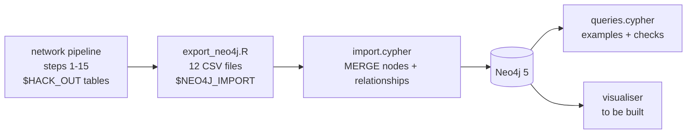
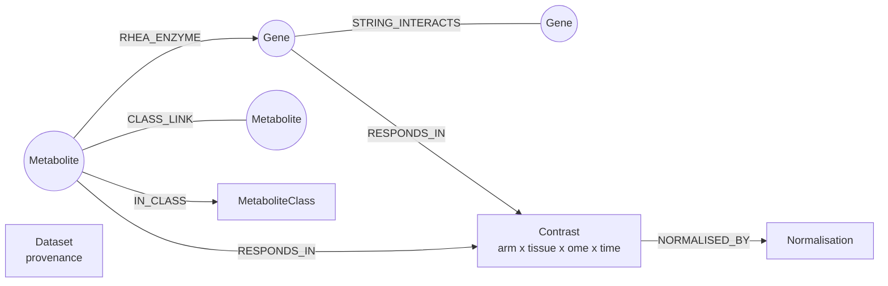

# Neo4j graph of the exercise networks (for the visualiser)

## 1. Project snapshot

| | |
|---|---|
| What | Everything the network pipeline knows about genes/proteins, metabolites, their exercise responses and their edges, as one Neo4j graph, so a visualiser can be built on top of it and grow as the pipeline adds details |
| Who | Track 1 network team; built for the teammate developing the Neo4j visualiser |
| Status | Export, import and example queries work and were tested end to end on Neo4j 5 Community (Docker) on 2026-09-26: all counts match, weights recomputed inside Neo4j equal the pipeline's to ~1e-16, re-import creates no duplicates. The visualiser itself is not started |
| Code | `export_neo4j.R` (pipeline outputs → CSVs), `import.cypher` (CSVs → graph), `queries.cypher` (examples + checks), `run_local_neo4j.sh` (one command: export, start Neo4j in Docker, import) |
| Data | Never in the repo: CSVs go to `$NEO4J_IMPORT` (default `$HACK_OUT/neo4j_import/`) |

## 2. Research question

The network pipeline (`network/README.md`) asks **which molecular relationships respond differently to
endurance (EE) and resistance (RE) exercise**, in a gene/protein network (STRING), a metabolite network
(Rhea enzymes + RefMet class) and a joint protein–metabolite network. The graph stores those networks, the
per-arm responses behind every edge weight, and the evidence for every edge, so a visualiser can let
people explore: *what is connected to this gene, how strongly in each arm, and why is the edge there?*

## 3. Workflow



## 4. Setup

| Tool | Version used | Needed for |
|---|---|---|
| R + `data.table` | R 4.4, data.table 1.18 | `export_neo4j.R` |
| Neo4j | 5.x (tested: `neo4j:5-community` Docker image) | the graph; `CALL {…} IN TRANSACTIONS` needs 4.4+ |
| Docker | 29.x (optional) | `run_local_neo4j.sh` (local throwaway database) |

**Quick start** (from the repo root, after running the pipeline — `network/README.md`, section 5):

```bash
bash network/neo4j/run_local_neo4j.sh          # export + start Neo4j in Docker + import; prints counts
# open http://localhost:7474 (no login) and paste queries from network/neo4j/queries.cypher
docker rm -f hackathon-neo4j                    # stop and delete the local database
```

**Without Docker** (Neo4j Desktop or a server): run `Rscript network/neo4j/export_neo4j.R`, copy the files
from `$HACK_OUT/neo4j_import/` into the database's *import* folder, then run `import.cypher` in Neo4j
Browser (enable multi-statement queries) or `cypher-shell -u neo4j -p <password> -f network/neo4j/import.cypher`.

## 5. Inputs and outputs

### Graph model



| Node label (key) | Count | Main properties |
|---|---|---|
| `Gene` (`entrez`) | 471 | `symbol`, `uniprot`, `in_string`, `string_degree`, `mean_response_EE/RE`, `joint_strength_EE/RE`, `joint_degree`, layouts `x_gene/y_gene` (figures 10a/11a), `x_joint/y_joint` (15a/15b), `x_joint14/y_joint14` (14a/14b), `feature_id_<tissue>_<ome>` (the transcript/protein used), `embedding_EE/RE` (16 numbers) + `embedding_dims` |
| `Metabolite` (`name`) | 450 | `refmet_name`, `refmet_id`, `super_class`, `main_class`, `chebi_id`, `pubchem_cid`, `inchi_key`, `platform_<tissue>`, `mean_response_EE/RE`, `joint_strength_EE/RE`, layouts `x_metab/y_metab` (10b/11b), `x_joint/y_joint`, `x_joint14/y_joint14`, `embedding_EE/RE` (9) + `embedding_dims`, `embedding_doubled_EE/RE` (16, aligned to the gene dimensions) |
| `MetaboliteClass` (`name`) | 13 | RefMet super class; `n_metabolites`, `n_in_joint_network` |
| `Contrast` (`id`, e.g. `EE\|blood\|rna\|4h`) | 50 | `arm`, `arm_label`, `tissue`, `ome` (rna / prot / metab), `time`, `time_h` |
| `Normalisation` (`ome`) | 3 | `divisor_max_abs_logFC`, `set_by` (the feature that sets it) — the critical QC step |
| `Dataset` (`name`) | 1 | `exported_at`, `code_commit`, `source_package`, `string_cutoff`, `rhea_release`, `normalisation` |

| Relationship | Count | Properties |
|---|---|---|
| `(:Gene)-[:STRING_INTERACTS]-(:Gene)` | 431 | `combined_score`, `w_EE`, `w_RE`, `w_diff`, `sig_EE`, `sig_RE`, `cos_EE`, `cos_RE` |
| `(:Metabolite)-[:CLASS_LINK]-(:Metabolite)` | 147 | `class`, `link_type`, `n_shared_proteins`, `shared_proteins`, `string_protein_pairs`, `w_EE`, `w_RE`, `w_diff`, `sig_EE`, `sig_RE` |
| `(:Metabolite)-[:RHEA_ENZYME]->(:Gene)` | 186 | `n_reactions`, `example_reactions` (Rhea IDs), `matched_via`, `w_EE`, `w_RE`, `w_diff` |
| `(:Metabolite)-[:IN_CLASS]->(:MetaboliteClass)` | 447 | (3 metabolites have no RefMet class) |
| `(:Gene\|Metabolite)-[:RESPONDS_IN]->(:Contrast)` | 23,172 | `logFC` (raw log2 fold change vs control), `normalised` (÷ the ome's divisor), `se` |
| `(:Contrast)-[:NORMALISED_BY]->(:Normalisation)` | 50 | |

Conventions: `w_diff = w_EE − w_RE` (positive = higher in endurance). Same-kind relationships are stored
once; query them undirected (`-[r]-`). Empty CSV cells become absent properties (e.g. `x_joint` is absent
for a gene with no edge in the joint network).

### Output files (`$NEO4J_IMPORT`)

`nodes_gene.csv`, `nodes_metabolite.csv`, `nodes_class.csv`, `nodes_contrast.csv`, `nodes_normalisation.csv`,
`nodes_dataset.csv`, `rel_string.csv`, `rel_class_link.csv`, `rel_rhea.csv`, `rel_in_class.csv`,
`rel_gene_response.csv`, `rel_metabolite_response.csv` — one file per node label / relationship type,
columns as the properties above; list properties are `;`-separated text.

### Where each piece comes from (key files in our code)

| Graph element | Pipeline script (repo) | Table read (`$HACK_OUT`) | Documented in `network/README.md` |
|---|---|---|---|
| Gene nodes, embeddings, responses, SEs, feature provenance | `network/01_node_embeddings.R` | `01_nodes_{EE,RE}.csv`, `_raw_logFC`, `_se`, `01_nodes_feature_provenance.csv`, `01_scale_factors.csv` | Step 1; "Critical QC step" |
| Metabolite nodes, embeddings, responses, platforms | `network/01b_metabolite_embeddings.R` | `01b_metab_nodes_{EE,RE}.csv`, `_raw_logFC`, `_se`, `01b_metab_nodes_provenance.csv`, `01b_metab_scale_factors.csv` | Step 1b |
| Metabolite identifiers and classes | `network/01c_metabolite_ids.py`, `network/01d_metabolite_classes.py` | `01c_metabolite_ids.csv` | Steps 1c, 1d |
| STRING membership, `STRING_INTERACTS` evidence | `network/02_string_edges.R` | `02_edges.csv`, `02_nodes_string.csv` | Step 2 (El-Kebir 2015 rules) |
| `STRING_INTERACTS` weights | `network/03_edge_weights.R` | `03_weighted_edges.csv` | Step 3 |
| `RHEA_ENZYME` evidence | `network/05_rhea_metabolite_protein.R` | `05_metabolite_protein_links.csv` | Step 5 |
| `CLASS_LINK` | `network/06_metabolite_network.R` | `06_metabolite_edges.csv` | Step 6 |
| Gene / metabolite network layouts | `network/10_plot_arm_networks.R` | `10_layout_genes.csv`, `10_layout_metabolites.csv` | Step 10 |
| `RHEA_ENZYME` weights (doubled metabolite embedding), joint strengths, 14a/b layout | `network/14_joint_network.R` | `14_joint_edges.csv`, `14_joint_nodes.csv` | Step 14 |
| Joint class-grouped layout | `network/15_joint_network_classes.R` | `15_class_layout.csv` | Step 15 |
| Reference visualiser (visual encoding, controls) | `network/17_interactive_networks.R` | — | Step 17 |

### Visual conventions to reuse (so the Neo4j visualiser matches the figures)

Taken from steps 10–17 (`17_interactive_networks.R` has all of them in one place, plus working JavaScript
for search, neighbour highlighting, class collapse and class outlines that can be ported):

| Element | Encoding |
|---|---|
| Node shape | proteins = circles, metabolites = triangles |
| Node fill, arm views | `mean_response_EE/RE`, diverging violet `#6A3D9A` – white – orange `#E66100`, limits ± 95th percentile of \|mean response\| |
| Node size | strength = sum of \|w\| over the node's edges (`joint_strength_EE/RE`) |
| Edge colour, arm views | type: STRING grey `#8C8C8C`, CLASS_LINK green `#1B7837`, RHEA_ENZYME brown `#8C510A`; dashed = negative weight |
| Edge colour, difference view | `w_diff`, blue `#2166AC` (higher in RE) – grey – red `#B2182B` (higher in EE), limits ± 95th percentile of \|w_diff\|; line style = type |
| Positions | `x_joint`/`y_joint` etc. are 0..1 (y up); multiply by the canvas size and flip y for screen coordinates |
| Words | "higher in endurance / resistance", never "stronger" (signed weights); titles descriptive, no claims |

## 6. Methods and provenance

- **Nothing is recomputed.** The export only reshapes pipeline outputs; every method choice (feature
  selection, per-ome max normalisation, STRING ≥ 700 gate, Rhea gate, class rule, dot-product weights,
  doubled metabolite embedding) is documented once, in `network/README.md`, and referenced above.
- **Embeddings.** Genes: 16 observed dimensions (tissue × ome × time; adipose protein exists at 4 h only,
  so its 0.5 h and 24 h dimensions are left out). Metabolites: 9 dimensions, plus the doubled 16-number
  version whose dot product with a gene's embedding *is* the `RHEA_ENZYME` weight (query 5 checks this).
- **Responses as relationships.** One `RESPONDS_IN` per node × contrast keeps the raw logFC, the normalised
  value and its standard error, so new contrasts, tissues or time points become new `Contrast` nodes
  rather than new columns.
- **Idempotent import.** Every node and relationship is `MERGE`d on its key, so re-running the import on a
  newer export updates properties in place.
- **AI use.** The export script, Cypher files, helper script and this README were written with Anthropic's
  Claude (Claude Code) and checked by the author against the pipeline outputs and a live Neo4j instance
  (section 7).

## 7. Validation

- `export_neo4j.R` stops if any count differs from its source table, if an embedding has an unexpected
  missing value, or if a `RHEA_ENZYME` weight recomputed from the exported embeddings differs from step 14.
- `import.cypher` ends by printing counts per label and relationship type.
- `queries.cypher` queries 5 and 6 recompute the metabolite–protein and gene–gene weights inside Neo4j from
  the stored embeddings (largest mismatch on 2026-09-26: 5e-17 and 6e-16).

**Expected counts** (2026-09-26): Gene 471, Metabolite 450, MetaboliteClass 13, Contrast 50,
Normalisation 3, Dataset 1; STRING_INTERACTS 431, CLASS_LINK 147, RHEA_ENZYME 186, IN_CLASS 447,
RESPONDS_IN 23,172, NORMALISED_BY 50. The joint-network pull (query 7) returns 364 nodes and 764 edges,
matching step 14.

## 8. Reuse and closeout: adding details as the pipeline grows

| To add | Do this |
|---|---|
| A new property on an existing node or edge (e.g. a new score) | add the column in `export_neo4j.R` (in the table it belongs to) and one `SET` line in `import.cypher` |
| A new edge type (e.g. a second STRING file, a disease link) | write a new `rel_<name>.csv` in `export_neo4j.R` and a new `LOAD CSV … MERGE (a)-[:NEW_TYPE]->(b)` block in `import.cypher`; add its count to section 7 |
| A new node type (e.g. `Disease`, `Pathway`, `RheaReaction`) | new `nodes_<name>.csv` + a uniqueness constraint + a load block; link it with a new relationship file |
| New contrasts, tissues or time points | nothing structural: they appear as new `Contrast` nodes and `RESPONDS_IN` rows (update the counts) |
| A different normalisation (step 12 is still an open decision) | re-run the pipeline, then the export; `Normalisation` nodes and `Dataset.code_commit` record what the graph holds |

Known limits: Rhea reactions are stored as the example IDs kept by step 5 (not reaction nodes);
differences between arms are descriptive, not tested; `run_local_neo4j.sh` runs without a password and
keeps the database inside the container (for local development only).
