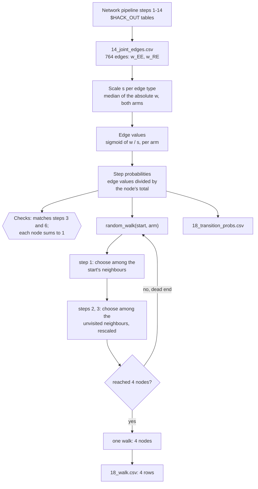

# Random walks on the joint exercise network (branch `random_walk`)

A function that generates one random walk from any protein or metabolite in the Track 1 joint network
to 3 other nodes. It follows the edges with probabilities set by the endurance (EE) or resistance (RE)
edge weights, so the same start node can lead to different places in the two exercise arms.

## Contents

1. [Project snapshot](#1-project-snapshot)
2. [Research question](#2-research-question)
3. [Background: where the network and its weights come from](#3-background-where-the-network-and-its-weights-come-from)
4. [Workflow](#4-workflow)
5. [Setup and how to run](#5-setup-and-how-to-run)
6. [The function `random_walk()`](#6-the-function-random_walk)
7. [Inputs](#7-inputs)
8. [Outputs, column by column](#8-outputs-column-by-column)
9. [Methods in detail](#9-methods-in-detail)
10. [Worked example: PPIB](#10-worked-example-ppib)
11. [Using the walks and the step probabilities](#11-using-the-walks-and-the-step-probabilities)
12. [Validation](#12-validation)
13. [Choices considered](#13-choices-considered)
14. [Known limits](#14-known-limits)
15. [Next steps](#15-next-steps)
16. [What this branch changes](#16-what-this-branch-changes)
17. [Glossary](#17-glossary)
18. [References, AI use](#18-references-ai-use)

## 1. Project snapshot

| | |
|---|---|
| What | `random_walk(start, arm)`: one weighted random walk from any start node (or a random one) to 3 other nodes of the joint protein + metabolite network, in the endurance or the resistance arm |
| Who | Track 1 network team (Stanford Multi-omics Hackathon 2026, *Exercise as Medicine*) |
| Status | Written and tested (2026-09-26); see section 12. Not part of the numbered network pipeline |
| Code | `random_walk/random_walks.R`: defines the function when `source()`d; generates one 4-node walk (saved as `18_walk.csv`) when run with `Rscript` |
| Data | MoTrPAC human pre-suspension study results, via the network pipeline's tables (read from `$HACK_OUT`). A command-line run writes two CSVs next to the script; `*.csv` is gitignored, so they are never committed |
| Depends on | Network pipeline up to step 14 (`network/README.md`, section 5) |

## 2. Research question

The network pipeline asks which molecular relationships respond differently to endurance and resistance
exercise. It builds one network whose **edges** are fixed by prior knowledge that never uses the
exercise data (STRING interactions, Rhea reactions, RefMet classes) and gives each edge a **weight per
arm** from the exercise data.

This branch asks:

> **Starting from one protein or metabolite, where does a short walk along the weighted edges lead,
> and where does it lead in endurance compared with resistance?**

A walk strings several edges together, so it can show a path such as *enzyme → metabolite → second
enzyme* that no single edge shows. The walk's choices at every step follow the arm's weights.

## 3. Background: where the network and its weights come from

Everything below is computed by the network pipeline; this branch only reads its tables.

| Piece | Pipeline step | Summary |
|---|---|---|
| Node vectors | 1 (genes), 1b (metabolites) | Each gene has 16 observed values (tissue × RNA/protein × time) of its exercise response (log2 fold change vs control), and each metabolite has 9 (tissue × time). Each ome's values are divided by that ome's maximum \|logFC\| (the pipeline's "critical QC step"), so every value lies in −1..+1 |
| Protein–protein edges | 2, 3 | STRING combined score ≥ 700; 431 edges |
| Metabolite–metabolite edges | 6 | the two metabolites share (or have STRING-interacting) Rhea enzymes among our 471 genes AND the same RefMet super class; 147 edges |
| Metabolite–protein edges | 5, 14 | the metabolite is a substrate or product of a Rhea reaction catalysed by the protein; 186 edges |
| Edge weight | 3, 6, 14 | the **dot product** of the two nodes' vectors, per arm. For metabolite–protein edges, the metabolite's 9 values are doubled to 18 (same value in the RNA and the protein slot) before the dot product |
| Joint network | 14 | all three edge types together: **364 nodes** (304 proteins, 60 metabolites) and **764 edges**, in `14_joint_edges.csv` |

How to read a weight w:

- **large positive:** the two nodes respond in the same direction, strongly;
- **large negative:** they respond in opposite directions, strongly;
- **near zero:** at least one barely responds, or the directions cancel across dimensions.

The weights are small numbers, and their typical size differs by edge type:

| Edge type | Edges | Median \|w\| (both arms) | Range of w | Negative in EE |
|---|---|---|---|---|
| protein – protein | 431 | 0.042 | −0.31 to +0.54 | 169 |
| metabolite – metabolite | 147 | 0.0070 | −0.13 to +0.20 | 61 |
| metabolite – protein | 186 | 0.013 | −0.14 to +0.09 | 85 |

Node names are gene symbols for proteins (e.g. `PPIB`) and metabolite names as in the pipeline
(e.g. `Palmitic acid`, `ATP`). The full list is the `node` column of `$HACK_OUT/14_joint_nodes.csv`.

## 4. Workflow



## 5. Setup and how to run

| Tool | Version used | Needed for |
|---|---|---|
| R | 4.5 | the script |
| `data.table` | 1.18 | all table work (the only package used) |

The project's R library is set by the repo's untracked `.Renviron` (`R_LIBS=...`), as for the pipeline.
Run the network pipeline up to step 14 first (`network/README.md`, section 5).

**From the command line:** one walk of 4 nodes, saved as the 4 rows of `18_walk.csv`. Three optional
arguments, in this order:

| Position | Argument | Default | Meaning |
|---|---|---|---|
| 1 | start node | random | a gene symbol or metabolite name; leave out or write `random` for a random start |
| 2 | arm | `EE` | `EE` (endurance) or `RE` (resistance): whose weights set the step probabilities |
| 3 | seed | none | a number that makes the walk reproducible |

```bash
Rscript random_walk/random_walks.R                         # random start node, endurance weights
Rscript random_walk/random_walks.R PPIB                    # start at PPIB, endurance weights
Rscript random_walk/random_walks.R PPIB RE                 # start at PPIB, resistance weights
Rscript random_walk/random_walks.R random RE 7             # random start, resistance, reproducible
Rscript random_walk/random_walks.R "Palmitic acid"         # quote names with spaces
```

Example output:

```
Random walk (resistance weights), start given:
  PPIB -> HSP90B1 -> CDC37 -> DNAJB1

Written: 18_transition_probs.csv, 18_walk.csv in /home/.../random_walk
```

**From R:** `source()` loads the network, runs the checks and defines the function. It generates and
writes nothing.

```r
source("random_walk/random_walks.R")      # from the repo root
random_walk()                                # random start node, endurance weights (default)
random_walk("PPIB")                          # start at PPIB, endurance weights
random_walk("PPIB", "RE")                    # resistance
random_walk("PPIB", "RE", seed = 1)          # the same walk every time
random_walk("ATP", "EE", revisit = TRUE)     # plain walk that may step back
random_walk("PPIB", "EE", n_steps = 5)       # a longer walk
```

**Environment variables:**

| Variable | Default | Meaning |
|---|---|---|
| `HACK_OUT` | `~/Desktop/output/hackathon-2026-track1/network` | folder with the pipeline's tables (inputs only) |
| `RW_OUT` | the script's own folder, `random_walk/` | where a command-line run writes its two CSVs |

## 6. The function `random_walk()`

```r
random_walk(start = NULL, arm = "EE", n_steps = 3, revisit = FALSE, seed = NULL, max_tries = 1000)
```

| Argument | Default | Meaning |
|---|---|---|
| `start` | `NULL` | the start node: any gene symbol or metabolite name in the joint network (all 364). `NULL` picks one at random; if the walk from it runs into a dead end, a new random start is picked (section 6, "Always 4 nodes"). An unknown name stops with an error naming it |
| `arm` | `"EE"` | `"EE"` (endurance) or `"RE"` (resistance): whose weights set the step probabilities. It is **not** a starting point: the walk always starts at `start` |
| `n_steps` | `3` (`N_STEPS`) | how many other nodes to walk to |
| `revisit` | `FALSE` | `FALSE`: never go back to a node already in the walk, so the walk visits `n_steps` *other, different* nodes. `TRUE`: a plain random walk that may step back, e.g. `A → B → A → B` |
| `seed` | `NULL` | a number makes the walk reproducible; `NULL` gives a new random walk on every call |
| `max_tries` | `1000` | how many times to start over after a dead end before giving up (section 6, "Always 4 nodes") |

**Returns** a `data.table` with one row per node visited: **4 rows** (`n_steps` + 1). The arm is not
repeated on every row, because it is the same for the whole walk and you chose it in the call.

| Column | Meaning |
|---|---|
| `step` | 0 for the start node, then 1, 2, 3 |
| `node` | the node visited |
| `p_step` | the probability of the step that reached this node, among the neighbours the walk could choose from at that point (1 for the start). With `revisit = FALSE` this is the rescaled probability, section 9.3 |

```
    step    node    p_step
   <int>  <char>     <num>
1:     0    PPIB 1.0000000
2:     1 HSP90B1 0.4206755
3:     2   CDC37 0.2059517
4:     3  DNAJB1 0.1824660
```

The product of `p_step` over the rows is the probability of that exact path, given the rule used.

**Always 4 nodes.** With `revisit = FALSE` a walk can run into a dead end: every neighbour of the
current node is already in the walk. This is common because many nodes have few neighbours (94 of the
364 have exactly one); in a single try, about 1 in 5 walks from a random start stops early. Such a try
is thrown away and the walk starts over, from a new random node if no start was given, or from the same
start if one was, until it reaches 4 different nodes (at most `max_tries` times). So:

- **Random start:** always 4 nodes. The start can be any of the 336 nodes from which 4 different nodes
  can be reached. The other 28 nodes (e.g. `SCP2`, `ACAA1`, `LSP1`) sit in pieces of the network with
  only 2 or 3 nodes, so a walk from them can never reach 4, and they are never returned as a start.
- **Given start:** 4 nodes, except from those 28 nodes. There the function returns the longest walk
  possible (2 or 3 rows) with a warning, and the command line says
  "only 3 nodes: this part of the network is too small for 4".

Starting over after a dead end means the walks are drawn only among the walks that reach 4 nodes.
Paths that avoid dead ends are therefore slightly more likely than their `p_step` product suggests.

## 7. Inputs

All from `$HACK_OUT`:

| File | Written by | Columns used | Used for |
|---|---|---|---|
| `14_joint_edges.csv` | step 14 | `node_a`, `node_b`, `edge_type`, `w_EE`, `w_RE` | the network and its weights |
| `03_weighted_edges.csv` | step 3 | `symbol_a`, `symbol_b`, `sig_EE`, `sig_RE` | check only (section 12) |
| `06_metabolite_edges.csv` | step 6 | `metabolite_a`, `metabolite_b`, `sig_EE`, `sig_RE` | check only (section 12) |

## 8. Outputs, column by column

Only a **command-line run** writes files: to `random_walk/` (or `$RW_OUT`), next to the script,
overwritten on every run. They are gitignored by the repo-wide `*.csv` rule, so each person regenerates
them locally. `source()` and calls to `random_walk()` write nothing; save a result yourself with
`fwrite()` if needed.

### `18_walk.csv`: the walk just generated, 4 rows

One walk, one row per node, columns as in section 6: `step` (0 = start), `node`, `p_step`. The start
node is the `step 0` row. The arm used is printed on screen and is the one given on the command line
(endurance if none was given).

### `18_transition_probs.csv`: 1,528 rows, one per edge direction

The step probabilities the walks use, for every node and both arms. Every undirected edge appears twice
(u → v and v → u), because the probability of stepping from u to v depends on u's other edges.

| Column | Meaning |
|---|---|
| `from`, `to` | the step's start and end node |
| `edge_type` | `protein - protein`, `metabolite - metabolite` or `metabolite - protein` |
| `s` | the sigmoid scale used for this edge type (section 9.1) |
| `w_EE`, `w_RE` | the edge weight in each arm (from step 14; identical for both directions) |
| `sig_EE`, `sig_RE` | σ(w / s), the edge value between 0 and 1 in each arm |
| `p_EE`, `p_RE` | the step probability from `from` to `to` in each arm; sums to 1 over each `from` |
| `p_diff` | `p_EE − p_RE`; positive = this step is more likely in endurance |

## 9. Methods in detail

### 9.1 Edge values: a sigmoid with one scale per edge type

Step probabilities must be ≥ 0, but the weights are signed. Each weight is first turned into a value
between 0 and 1:

```
sig(u,v) = σ(w_uv / s) = 1 / (1 + exp(−w_uv / s))
```

- w = 0 gives 0.5; positive weights give more than 0.5, negative weights less.
- The edges' order and signs are kept; only the steepness depends on s ("temperature scaling").
- **s = median |w| over both arms, separately for each edge type**: 0.042 (protein–protein), 0.0070
  (metabolite–metabolite), 0.013 (metabolite–protein). With one s for the whole joint network (0.022),
  almost every metabolite edge would land near 0.5 and look alike, because metabolite weights are 3–6
  times smaller.
- For the protein–protein and metabolite–metabolite edges this is exactly the `sig_EE` / `sig_RE` that
  steps 3 and 6 already provide for "methods that need positive weights"; the script checks this.
- **One s for both arms**, as in step 3: a given weight maps to the same value in either arm.

### 9.2 Step probabilities

From node u, the walk moves to neighbour v with probability

```
P(u → v) = sig(u,v) / Σ_k sig(u,k)        (sum over all neighbours k of u)
```

That is, the edge values are divided by their total at u so they add up to 1, separately with the EE
and the RE weights. These are the `p_EE` / `p_RE` columns of `18_transition_probs.csv`.

Because σ never exceeds 1, the strongest possible edge at a node gets at most twice the probability of
an edge with weight 0. Strongly negative edges get values close to 0 and are almost never walked: 7
(EE) and 24 (RE) of the 1,528 steps have a probability below 0.001, e.g. ATP → Inosine in RE (2 × 10⁻⁹).

### 9.3 One walk

1. Start at `start`.
2. Take the current node's neighbours and their step probabilities in the chosen arm.
3. With `revisit = FALSE`, remove the neighbours already in the walk and divide the remaining
   probabilities by their sum, so they again add up to 1. If none is left (dead end), throw the walk
   away and go back to step 1 (with a new random start if none was given).
4. Choose one neighbour at random with those probabilities (`sample.int(..., prob = ...)`), add it to
   the walk and record its probability as `p_step`.
5. Repeat steps 2–4 until `n_steps` other nodes have been visited.

Step 3 changes the rule after the first step: removing visited nodes and rescaling makes the walk a
"self-avoiding" walk, not a plain Markov random walk. The first step is always the plain step
probability.

## 10. Worked example: PPIB

PPIB (peptidyl-prolyl isomerase B) has 4 protein neighbours, and they are weighted very differently in
the two arms (`18_transition_probs.csv`, s = 0.0416):

| to | w_EE | w_RE | σ(w/s) EE | σ(w/s) RE | P EE | P RE | P EE − RE |
|---|---|---|---|---|---|---|---|
| BSG | +0.017 | −0.063 | 0.603 | 0.179 | 0.318 | 0.083 | +0.235 |
| HSP90B1 | −0.118 | +0.097 | 0.055 | 0.912 | 0.029 | 0.421 | −0.392 |
| HYOU1 | −0.039 | +0.087 | 0.282 | 0.889 | 0.149 | 0.410 | −0.262 |
| P4HB | +0.130 | −0.061 | 0.958 | 0.187 | 0.505 | 0.086 | +0.418 |

For example, in EE the four σ values add up to 0.603 + 0.055 + 0.282 + 0.958 = 1.898, so
P(PPIB → P4HB) = 0.958 / 1.898 = 0.505.

In words: after endurance, PPIB responds with P4HB and BSG, so a walk usually goes there first
(82% of the time). After resistance it responds with HSP90B1 and HYOU1 instead (83%).

**Second step without revisits.** Suppose a walk went PPIB → HSP90B1. At HSP90B1, PPIB is removed from
the choices and the other neighbours' probabilities are rescaled to add up to 1. In the RE walk of
section 6 (seed 1) the walk then chose CDC37 with rescaled probability 0.206, and from CDC37 chose
DNAJB1 with 0.182. That exact path had probability 0.421 × 0.206 × 0.182 ≈ 0.016.

## 11. Using the walks and the step probabilities

**Many walks from one node, to see which paths are typical:**

```r
source("random_walk/random_walks.R")
set.seed(1)
w <- rbindlist(lapply(1:1000, function(i) random_walk("PPIB", "RE")[, walk := i]))
w[step == 3, .N, by = node][order(-N)]                  # where walks end after 3 steps
w[, .(path = paste(node, collapse = " > ")), by = walk][, .N, by = path][order(-N)][1:10]
```

**Compare the arms from one node:**

```r
e <- rbindlist(lapply(1:1000, function(i) random_walk("PPIB", "EE")[, walk := i]))
merge(e[step == 3, .(EE = .N / 1000), by = node], w[step == 3, .(RE = .N / 1000), by = node],
      by = "node", all = TRUE)
```

**Which single steps change most between the arms:**

```r
D[order(-abs(p_diff))][1:20]                            # D is the step table defined by the script
D[p_EE < 1e-3 | p_RE < 1e-3]                            # steps practically never taken in one arm
```

**Save a walk from R:** `fwrite(random_walk("PPIB", "RE", seed = 1), "random_walk/my_walk.csv")`.

Reading tips:

- **One walk is one random draw.** It shows a possible path, not the typical one. For "typical", run
  many walks (above) and count.
- **A walk with fewer than 4 rows** only happens when you give a start node in a piece of the network
  with fewer than 4 nodes (section 6).
- **Say "more likely in endurance / resistance"**, not "stronger". The weights are signed, and an
  unlikely step can be a strongly negative relationship.


## 12. Validation

**Built into the script** (it stops with an error if any fails):

| Check | When | What it guards against |
|---|---|---|
| The σ(w/s) values of every protein–protein and metabolite–metabolite edge equal `sig_EE` / `sig_RE` of steps 3 and 6 (and all 431 + 147 edges are found) | every load (`source()` or `Rscript`) | a scale or edge mismatch with the pipeline |
| Every node's outgoing step probabilities add up to 1 (to 10⁻¹²) in both arms | every load | a normalisation error |
| Each walk starts at the start node, every consecutive pair of nodes is an edge of the network, and no node repeats | command-line run | a walk jumping between unconnected nodes or revisiting |

**Tested by hand on 2026-09-26:**

| Test | Result |
|---|---|
| 20,000 one-step walks from PPIB (EE): share of walks to each neighbour vs its step probability | BSG 0.320 vs 0.318, HSP90B1 0.029 vs 0.029, HYOU1 0.151 vs 0.149, P4HB 0.500 vs 0.505 |
| Same `seed`, same arguments, twice | identical walks |
| 2,000 calls with no start node | all 2,000 walks have exactly 4 nodes |
| 6,000 calls with no start node | 336 different start nodes: every node except the 28 in pieces of the network with fewer than 4 nodes |
| Every node as the given start | 336 give 4 nodes; 28 give 2 or 3 nodes with a warning |
| Command line: no arguments; `PPIB RE 1`; `"Palmitic acid" ee` (lower case) | one walk, 4 rows in `18_walk.csv`; arm name not case-sensitive |
| Command line: `PPIB XX` (unknown arm) | stops with an error listing `EE` and `RE` |
| Command line: `SCP2` (piece of 3 nodes) | `SCP2 -> ACAA1 -> ACOX1`, 3 rows, warning |
| `revisit = TRUE` from ATP | ATP → Adenosine → ADA → Adenosine (steps back, as intended) |
| Unknown start node (`NOTAGENE`) | stops with an error naming the node |
| Metabolite name with spaces from the command line (`"Palmitic acid"`) | works |

## 13. Choices considered

### Sigmoid vs softmax for the step probabilities

A softmax over the neighbours, P(u → v) = exp(w_uv/τ) / Σ_k exp(w_uk/τ), was compared with the sigmoid
on the EE weights of the joint network (nodes with at least 2 neighbours, one shared scale 0.022):

| Transform | Mean largest step probability | Nodes with > 90% on one edge | Effective neighbours ÷ degree | Probability on negative edges |
|---|---|---|---|---|
| **σ(w/s), normalised per node (used)** | 0.42 | 4% | 0.88 | 0.24 |
| softmax, τ = s | 0.66 | 28% | 0.63 | 0.14 |
| softmax, τ = 5s | 0.41 | 1% | 0.92 | 0.30 |
| \|w\|, normalised per node | 0.51 | 4% | 0.79 | 0.36 |

- With a softmax at the same scale, more than a quarter of the nodes become near-deterministic: the walk
  almost always takes the single strongest edge.
- A softmax only behaves reasonably with a 5 times higher temperature, a free parameter with no
  principled value.
- The sigmoid is bounded, already exists in the pipeline with a documented scale, and is the standard
  edge-probability decoder for dot-product embeddings (LINE; graph autoencoders).
- For negative weights the two are nearly the same, since σ(x) ≈ eˣ there. They differ in how the
  sigmoid levels off for positive weights.

### Signed weights vs |w|

Both the sigmoid and the softmax treat a negative weight as a *weak* link. Using |w| would treat
opposite responses as *close*. Which is right is a biological question (are two STRING partners that
respond in opposite directions "related" by exercise?), not a mathematical one. The script uses the
signed version; switching means replacing `plogis(w_EE / s)` and `plogis(w_RE / s)` with `abs(w_EE)` and
`abs(w_RE)`.

### Visiting 3 *other* nodes vs a plain walk

In a plain random walk from every node, 55% of 4-node walks stepped back to a node already visited, and
a walk covered only 3.25 different nodes on average: many nodes have 1–2 neighbours, so walks bounce.
Since the aim is to reach 3 other nodes, the default forbids revisits (`revisit = FALSE`). The price is
that walks from sparse corners stop early (section 6). `revisit = TRUE` keeps the plain walk.

### One scale for the whole network vs one per edge type

One per edge type (section 9.1), because the three types' weights differ in size by a factor of 3–6.
This is a heuristic, and it decides how a metabolite edge competes with a protein edge at nodes that
have both.

## 14. Known limits

- **One walk is a single random sample.** Conclusions need many walks (section 11) and, for the arm
  comparison, a null model (section 15).
- **Starting over after a dead end** means walks are drawn only among those that reach 4 nodes, which
  slightly favours paths through well-connected nodes (section 6).
- **Negative weights count as weak links** (section 13).
- **The per-type scale s is a heuristic** (median heuristic by analogy, as in step 3).
- **Only the joint network (step 14).** Nodes without edges cannot be start nodes: 167 of the 471 genes
  and 390 of the 450 metabolites have no edge in the joint network.
- **Weights carry no uncertainty.** The standard errors of the logFCs (step 1 `_se` tables) are not
  propagated into the step probabilities.
- **Naming.** The script carries the step number `18_` although it lives outside `network/`. Pipeline
  step 18 is not claimed by anything else yet.

## 15. Next steps

1. **Typical paths:** for each start node, run many walks per arm and summarise where they end (as in
   section 11).
2. **Null model:** permute the weights among edges of the same type, or rewire the network keeping each
   node's degree, and compare the arms' walk distributions with those under the null.
3. **Seeds from the disease layer:** once disease-associated genes are chosen, start walks from them and
   compare the nodes reached in each arm.
4. **Walk variants:** |w| weights; random walk with restart.
5. **Integration:** if the team keeps this, move it into the pipeline as a numbered step, add checks to
   `network/99_validate_outputs.R`, and list it in `network/README.md`.

## 16. What this branch changes

Compared with `main`:

| Change | Detail |
|---|---|
| Added `random_walk/` | `random_walks.R` and this README |
| Removed `network/neo4j/` | the Neo4j export (`export_neo4j.R`, `import.cypher`, `queries.cypher`, `run_local_neo4j.sh`, `README.md`). It is still on `main` and in the history (commits `27ce353`, `d60097d`) |
| Edited `network/README.md` | removed the paragraph on the Neo4j graph and its line in the file tree, since the folder is gone |

The network pipeline itself (`network/*.R`, `network/*.py`) is unchanged.

## 17. Glossary

| Term | Meaning here |
|---|---|
| EE / RE | endurance / resistance exercise arm |
| Weight w | dot product of two nodes' normalised response vectors in one arm; signed |
| σ, sigmoid | σ(x) = 1 / (1 + e⁻ˣ), maps any number to 0–1 |
| Scale s | the number the weights are divided by before σ; median \|w\| per edge type |
| Step probability | probability that the walk moves from a node to one particular neighbour |
| Degree | number of neighbours of a node |
| Dead end | a node whose neighbours are all already in the walk; the walk is thrown away and started over |
| Self-avoiding walk | a walk that never visits the same node twice (`revisit = FALSE`) |
| Seed | a number that fixes R's random draws, so the same call gives the same walk |

## 18. References, AI use

- Hamilton, Ying & Leskovec (2017). Representation learning on graphs: methods and applications.
  *IEEE Data Engineering Bulletin*. Dot product as node similarity (used for the pipeline's weights).
- Tang et al. (2015). LINE: large-scale information network embedding. *WWW*. Sigmoid of a dot
  product as edge probability.
- Kipf & Welling (2016). Variational graph auto-encoders. *NIPS Workshop on Bayesian Deep Learning*.
  Sigmoid decoder.
- Hinton, Vinyals & Dean (2015). Distilling the knowledge in a neural network. Temperature scaling.
- Guo et al. (2017). On calibration of modern neural networks. *ICML*. Temperature scaling.
- Gretton et al. (2012). A kernel two-sample test. *JMLR*. Median heuristic (by analogy, for s).
- Perozzi, Al-Rfou & Skiena (2014). DeepWalk. *KDD*; Grover & Leskovec (2016). node2vec. *KDD*.
  Short random walks on graphs.

**AI use.** The script and this README were written with Anthropic's Claude (Claude Code) and checked by
the author against the pipeline outputs. All numbers were produced on 2026-09-26.
